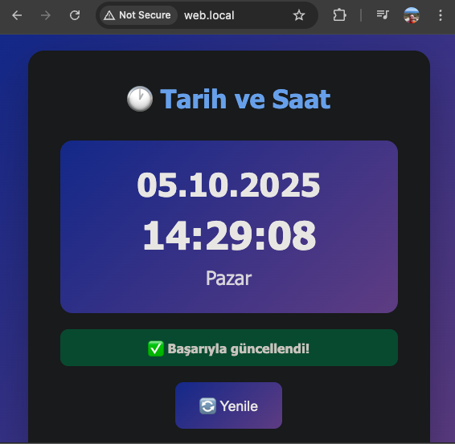
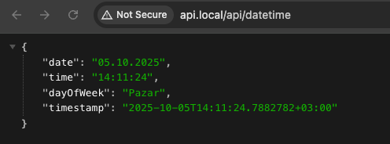

# DateTime Kubernetes Application

.NET 9 Minimal API ve Nginx üzerinde çalışan web uygulaması için tam Kubernetes deployment çözümü.

## ✨ Özellikler

- 🚀 **Multi-Node Kubernetes Cluster**: 1 Control-Plane + 2 Worker Node
- ⚡ **Otomatik Deployment**: Tek komutla (`make deploy`) tam kurulum
- 🔧 **Mac Optimized**: hostNetwork ve webhook sorunları otomatik düzeltilir
- 📦 **Kind Integration**: Local Kubernetes cluster (Docker içinde)
- 🌐 **Ingress Support**: http://api.local ve http://web.local
- 🐳 **Docker Build**: Otomatik imaj build ve yükleme
- 🎯 **Makefile Commands**: 25+ hazır komut
- 📊 **Monitoring**: Log izleme, durum kontrolleri
- 🔄 **Scaling**: Kolay replica yönetimi
- 🧪 **Testing**: Otomatik endpoint testleri

## 📸 Screenshots

### Web Application


_DateTime web uygulaması - Türkçe tarih ve saat gösterimi_

### API Response


_REST API JSON sonucu_

### Docker Desktop - Kubernetes


_Docker Desktop üzerinde çalışan Kind cluster_

### Terminal - Deployment Success

## 📋 Deployment Çıktısı

<details>
<summary><b>🚀 Tam Deployment Çıktısını Görmek İçin Tıklayın</b> (make deploy komutunun tüm adımları)</summary>

```bash
🚀 Kind cluster kontrol ediliyor...
No kind clusters found.
Kind cluster oluşturuluyor (1 control-plane + 2 workers)...
✓ kind-config.yaml mevcut, kullanılıyor
Creating cluster "kind" ...
 ✓ Ensuring node image (kindest/node:v1.34.0) 🖼
 ✓ Preparing nodes 📦 📦 📦
 ✓ Writing configuration 📜
 ✓ Starting control-plane 🕹️
 ✓ Installing CNI 🔌
 ✓ Installing StorageClass 💾
 ✓ Joining worker nodes 🚜
Set kubectl context to "kind-kind"
You can now use your cluster with:

kubectl cluster-info --context kind-kind

Have a question, bug, or feature request? Let us know! https://kind.sigs.k8s.io/#community 🙂
✓ Multi-node Kind cluster oluşturuldu

Cluster Node'ları:
NAME                 STATUS     ROLES           AGE   VERSION   INTERNAL-IP   EXTERNAL-IP   OS-IMAGE                         KERNEL-VERSION     CONTAINER-RUNTIME
kind-control-plane   NotReady   control-plane   15s   v1.34.0   172.20.0.3    <none>        Debian GNU/Linux 12 (bookworm)   6.10.14-linuxkit   containerd://2.1.3
kind-worker          NotReady   <none>          0s    v1.34.0   172.20.0.4    <none>        Debian GNU/Linux 12 (bookworm)   6.10.14-linuxkit   containerd://2.1.3
kind-worker2         NotReady   <none>          1s    v1.34.0   172.20.0.2    <none>        Debian GNU/Linux 12 (bookworm)   6.10.14-linuxkit   containerd://2.1.3
📥 NGINX Ingress Controller kontrol ediliyor...
NGINX Ingress Controller kuruluyor (Kind için optimize edilmiş)...
Özel ingress-nginx-deployment.yaml kullanılıyor...
namespace/ingress-nginx created
serviceaccount/ingress-nginx created
configmap/ingress-nginx-controller created
clusterrole.rbac.authorization.k8s.io/ingress-nginx created
clusterrolebinding.rbac.authorization.k8s.io/ingress-nginx created
role.rbac.authorization.k8s.io/ingress-nginx created
rolebinding.rbac.authorization.k8s.io/ingress-nginx created
service/ingress-nginx-controller created
deployment.apps/ingress-nginx-controller created
ingressclass.networking.k8s.io/nginx created
pod/ingress-nginx-controller-7884c64dd8-8ws87 condition met
✓ NGINX Ingress Controller kuruldu
🔧 Ingress yapılandırması kontrol ediliyor...
hostNetwork ayarı düzeltiliyor...
deployment.apps/ingress-nginx-controller patched (no change)
deployment "ingress-nginx-controller" successfully rolled out
pod/ingress-nginx-controller-7884c64dd8-8ws87 condition met
✓ hostNetwork ayarı düzeltildi
🔧 Ingress Controller control-plane kontrolü yapılıyor...
✓ Ingress Controller zaten control-plane'de

Ingress Controller Durumu:
NAME                                        READY   STATUS    RESTARTS   AGE   IP           NODE                 NOMINATED NODE   READINESS GATES
ingress-nginx-controller-7884c64dd8-8ws87   1/1     Running   0          42s   172.20.0.3   kind-control-plane   <none>           <none>
🧹 Admission webhook'ları temizleniyor...
✓ Webhook'lar temizlendi
🔨 API imajı build ediliyor...
[+] Building 0.1s (15/15) FINISHED                                                                                                                                                       docker:desktop-linux
 => [internal] load build definition from Dockerfile.api                                                                                                                                                 0.0s
 => => transferring dockerfile: 1.13kB                                                                                                                                                                   0.0s
 => [internal] load metadata for mcr.microsoft.com/dotnet/aspnet:9.0                                                                                                                                     0.0s
 => [internal] load metadata for mcr.microsoft.com/dotnet/sdk:9.0                                                                                                                                        0.0s
 => [internal] load .dockerignore                                                                                                                                                                        0.0s
 => => transferring context: 2B                                                                                                                                                                          0.0s
 => [build 1/6] FROM mcr.microsoft.com/dotnet/sdk:9.0                                                                                                                                                    0.0s
 => [stage-1 1/3] FROM mcr.microsoft.com/dotnet/aspnet:9.0                                                                                                                                               0.0s
 => [internal] load build context                                                                                                                                                                        0.0s
 => => transferring context: 1.13kB                                                                                                                                                                      0.0s
 => CACHED [stage-1 2/3] WORKDIR /app                                                                                                                                                                    0.0s
 => CACHED [build 2/6] WORKDIR /src                                                                                                                                                                      0.0s
 => CACHED [build 3/6] COPY DateTimeApi.csproj .                                                                                                                                                         0.0s
 => CACHED [build 4/6] RUN dotnet restore                                                                                                                                                                0.0s
 => CACHED [build 5/6] COPY Program.cs .                                                                                                                                                                 0.0s
 => CACHED [build 6/6] RUN dotnet publish -c Release -o /app/publish                                                                                                                                     0.0s
 => CACHED [stage-1 3/3] COPY --from=build /app/publish .                                                                                                                                                0.0s
 => exporting to image                                                                                                                                                                                   0.0s
 => => exporting layers                                                                                                                                                                                  0.0s
 => => writing image sha256:7cf26d6790c6d0f93d389955674794f21186fbb4d3cc23b85a04998420da8fbb                                                                                                             0.0s
 => => naming to docker.io/library/datetime-api:latest                                                                                                                                                   0.0s

View build details: docker-desktop://dashboard/build/desktop-linux/desktop-linux/ug4f5swe8vhtv1dh6k5xrv1kh

What's next:
    View a summary of image vulnerabilities and recommendations → docker scout quickview
✓ API imajı oluşturuldu
🔨 Web imajı build ediliyor...
[+] Building 1.4s (9/9) FINISHED                                                                                                                                                         docker:desktop-linux
 => [internal] load build definition from Dockerfile.web                                                                                                                                                 0.0s
 => => transferring dockerfile: 197B                                                                                                                                                                     0.0s
 => [internal] load metadata for docker.io/library/nginx:alpine                                                                                                                                          1.4s
 => [auth] library/nginx:pull token for registry-1.docker.io                                                                                                                                             0.0s
 => [internal] load .dockerignore                                                                                                                                                                        0.0s
 => => transferring context: 2B                                                                                                                                                                          0.0s
 => [1/3] FROM docker.io/library/nginx:alpine@sha256:42a516af16b852e33b7682d5ef8acbd5d13fe08fecadc7ed98605ba5e3b26ab8                                                                                    0.0s
 => [internal] load build context                                                                                                                                                                        0.0s
 => => transferring context: 4.98kB                                                                                                                                                                      0.0s
 => CACHED [2/3] COPY index.html /usr/share/nginx/html/                                                                                                                                                  0.0s
 => CACHED [3/3] COPY nginx.conf /etc/nginx/conf.d/default.conf                                                                                                                                          0.0s
 => exporting to image                                                                                                                                                                                   0.0s
 => => exporting layers                                                                                                                                                                                  0.0s
 => => writing image sha256:ba567103d6999c7403ddd693cc8bfc237215c35d755d66e0fa8e176fca0fe72f                                                                                                             0.0s
 => => naming to docker.io/library/datetime-web:latest                                                                                                                                                   0.0s

View build details: docker-desktop://dashboard/build/desktop-linux/desktop-linux/o374uxx366j3xlvfeywt88mce

What's next:
    View a summary of image vulnerabilities and recommendations → docker scout quickview
✓ Web imajı oluşturuldu
✓ Tüm imajlar oluşturuldu
📦 İmajlar Kind cluster'a yükleniyor...
Image: "datetime-api:latest" with ID "sha256:7cf26d6790c6d0f93d389955674794f21186fbb4d3cc23b85a04998420da8fbb" not yet present on node "kind-control-plane", loading...
Image: "datetime-api:latest" with ID "sha256:7cf26d6790c6d0f93d389955674794f21186fbb4d3cc23b85a04998420da8fbb" not yet present on node "kind-worker", loading...
Image: "datetime-api:latest" with ID "sha256:7cf26d6790c6d0f93d389955674794f21186fbb4d3cc23b85a04998420da8fbb" not yet present on node "kind-worker2", loading...
Image: "datetime-web:latest" with ID "sha256:ba567103d6999c7403ddd693cc8bfc237215c35d755d66e0fa8e176fca0fe72f" not yet present on node "kind-control-plane", loading...
Image: "datetime-web:latest" with ID "sha256:ba567103d6999c7403ddd693cc8bfc237215c35d755d66e0fa8e176fca0fe72f" not yet present on node "kind-worker", loading...
Image: "datetime-web:latest" with ID "sha256:ba567103d6999c7403ddd693cc8bfc237215c35d755d66e0fa8e176fca0fe72f" not yet present on node "kind-worker2", loading...
✓ İmajlar yüklendi
📦 Kubernetes kaynakları uygulanıyor...
deployment.apps/datetime-api created
service/datetime-api-service created
✓ API deployment uygulandı
deployment.apps/datetime-web created
service/datetime-web-service created
✓ Web deployment uygulandı
ingress.networking.k8s.io/datetime-ingress created
✓ Ingress uygulandı

⏳ Deployment'ların hazır olması bekleniyor...
deployment.apps/datetime-api condition met
deployment.apps/datetime-web condition met
✓ Tüm deployment'lar hazır
📝 /etc/hosts dosyası güncelleniyor...
✓ /etc/hosts zaten güncel

======================================
🎉 Deployment tamamlandı! 🎉
======================================

⏱️  Toplam Süre: 1 dakika 45 saniye

📊 Durum Bilgisi:
NAME                            READY   STATUS    RESTARTS   AGE   IP           NODE           NOMINATED NODE   READINESS GATES
datetime-api-7c496c6d89-k77pn   1/1     Running   0          10s   10.244.1.2   kind-worker2   <none>           <none>
datetime-api-7c496c6d89-wmd4f   1/1     Running   0          10s   10.244.2.2   kind-worker    <none>           <none>
datetime-web-567d9789cd-jsgp7   1/1     Running   0          10s   10.244.1.3   kind-worker2   <none>           <none>
datetime-web-567d9789cd-rcdpn   1/1     Running   0          10s   10.244.2.3   kind-worker    <none>           <none>

NAME                   TYPE        CLUSTER-IP     EXTERNAL-IP   PORT(S)   AGE
datetime-api-service   ClusterIP   10.96.89.149   <none>        80/TCP    10s
datetime-web-service   ClusterIP   10.96.202.69   <none>        80/TCP    10s
kubernetes             ClusterIP   10.96.0.1      <none>        443/TCP   82s

NAME               CLASS   HOSTS                 ADDRESS   PORTS   AGE
datetime-ingress   nginx   api.local,web.local             80      9s

======================================
🌐 Uygulamaya Erişim:
======================================
  Web Uygulaması: http://web.local
  API: http://api.local/api/datetime

```

**Deployment Süresi:** M1-Max (32 GB)

- İlk deployment: ~2-2.5 dakika
- Cached build ile: ~1 dakika 45 saniye ✅

**Oluşturulan Kaynaklar:**

- ✅ Multi-node Kubernetes cluster (1 control-plane + 2 workers)
- ✅ NGINX Ingress Controller (control-plane'de)
- ✅ 2x datetime-api pods (worker node'larda)
- ✅ 2x datetime-web pods (worker node'larda)
- ✅ Services ve Ingress yapılandırması

</details>

## ⚡ TL;DR (Çok Hızlı Başlangıç)

### Shell Script ile

```bash
# 1. Proje dizinini oluşturun
mkdir -p datetime-k8s/{api,web,k8s}

# 2. setup-project.sh'i çalıştırın (opsiyonel - sadece dizin yapısını gösterir)
chmod +x setup-project.sh
./setup-project.sh

# 3. Tüm dosyaları ilgili klasörlere kopyalayın

# 4. Proje dizinine girin
cd datetime-k8s

# 5. Script'leri çalıştırılabilir yapın
chmod +x *.sh

# 6. Deploy edin!
./deploy.sh

# 7. Test edin (opsiyonel)
./verify-deployment.sh

# 8. Tarayıcıda açın
open http://web.local
```

### Makefile ile (Önerilen! 🎯)

```bash
# 1. Proje dizinini oluşturun ve dosyaları yerleştirin
mkdir -p datetime-k8s/{api,web,k8s}

# 2. Tüm dosyaları ilgili klasörlere kopyalayın:
#    - Makefile -> datetime-k8s/
#    - api/* -> datetime-k8s/api/
#    - web/* -> datetime-k8s/web/
#    - k8s/* -> datetime-k8s/k8s/
#    - *.yaml, *.sh -> datetime-k8s/

# 3. Proje dizinine girin
cd datetime-k8s

# 4. Dizin yapısını kontrol edin (opsiyonel)
make setup

# 5. Tek komutla deploy edin!
make deploy

# 6. Doğrulayın
make verify

# 7. Tarayıcıda açın
open http://web.local
```

**Hepsi bu kadar!** 🎉 Uygulama çalışır durumda.

---

## 📁 Proje Yapısı

```
datetime-k8s/
├── api/                        # .NET 9 API
│   ├── Program.cs              # .NET 9 Minimal API
│   ├── DateTimeApi.csproj      # Proje dosyası
│   └── Dockerfile.api          # API Docker image
├── web/                        # Nginx Web App
│   ├── index.html              # Web UI (Vanilla JS)
│   ├── nginx.conf              # Nginx yapılandırması
│   └── Dockerfile.web          # Web Docker image
├── k8s/                        # Kubernetes Manifests
│   ├── api-deployment.yaml     # API Deployment + Service
│   ├── web-deployment.yaml     # Web Deployment + Service
│   ├── kind-config.yaml        # ⚙️ Kind cluster config (multi-node)
│   ├── ingress.yaml            # Ingress (api.local, web.local)
│   └── ingress-nginx-deployment.yaml  # 🆕 Ingress Controller (Kind optimized)
├── Makefile                    # 🎯 Ana otomasyon (ÖNERİLEN!)
├── deploy.sh                   # 🚀 Deployment script
├── verify-deployment.sh        # 🔍 Doğrulama ve test script
├── fix-ingress.sh              # 🔧 hostNetwork düzeltme
├── fix-webhooks.sh             # 🔧 Webhook temizleme
├── patch-ingress-controller.sh # 🔧 Ingress patch
├── setup-project.sh            # 📁 Dizin yapısı oluşturma
├── README.md                   # 📖 Ana dokümantasyon
├── TROUBLESHOOTING.md          # 🆘 Sorun giderme rehberi (ÖNEMLİ!)
├── WORKER_NODES.md             # 📘 Multi-node cluster rehberi
├── INGRESS_ROUTING.md          # 📘 Ingress routing açıklaması
├── INGRESS_CONTROLLER_FIX.md   # 📘 Ingress düzeltme yöntemleri
├── INGRESS_SETUP.md            # 📘 Ingress kurulum rehberi
├── LOAD_BALANCING.md           # 📘 Load balancing stratejileri
└── CHANGES_SUMMARY.md          # 📄 Değişiklikler özeti
```

### 📜 Script ve Makefile Karşılaştırması

| Özellik            | Makefile                      | Shell Scripts            |
| ------------------ | ----------------------------- | ------------------------ |
| Kullanım Kolaylığı | ⭐⭐⭐⭐⭐ `make deploy`      | ⭐⭐⭐⭐ `./deploy.sh`   |
| Modülerlik         | ⭐⭐⭐⭐⭐ Her komut ayrı     | ⭐⭐⭐ Monolitik         |
| Hata Yönetimi      | ⭐⭐⭐⭐⭐ Otomatik           | ⭐⭐⭐⭐ Manuel          |
| İleri Seviye       | ⭐⭐⭐⭐⭐ Scale, restart vb. | ⭐⭐⭐ Temel işlemler    |
| Öğrenme Eğrisi     | ⭐⭐⭐ Makefile bilgisi       | ⭐⭐⭐⭐ Bash bilgisi    |
| Multi-Node         | ✅ Otomatik config oluşturma  | ✅ Manuel config gerekir |

**Öneri:** Makefile kullanın! Daha esnek ve güçlü. 🎯

```
├── web/
│ ├── index.html # Web UI (Vanilla JS)
│ ├── nginx.conf # Nginx yapılandırması
│ └── Dockerfile.web # Web Docker image
├── k8s/
│ ├── api-deployment.yaml # API Deployment + Service
│ ├── web-deployment.yaml # Web Deployment + Service
│ └── ingress.yaml # Ingress (api.local, web.local)
├── deploy.sh # 🚀 ANA DEPLOYMENT SCRIPT
├── verify-deployment.sh # 🔍 Doğrulama ve test script
├── fix-ingress.sh # 🔧 hostNetwork düzeltme
├── fix-webhooks.sh # 🔧 Webhook temizleme
├── kind-config.yaml # Kind cluster yapılandırması
└── README.md # Dokümantasyon
```

````

### 📜 Script Açıklamaları

| Script | İşlevi | Kullanım Sıklığı |
|--------|--------|------------------|
| **deploy.sh** | Sıfırdan full deployment | Bir kez (başlangıç) |
| **verify-deployment.sh** | Durum kontrolü ve test | Her zaman (test için) |
| **fix-ingress.sh** | hostNetwork sorunu için | Gerektiğinde |
| **fix-webhooks.sh** | Webhook sorunu için | Gerektiğinde |

### 📄 Yapılandırma Dosyası

| Dosya | İşlevi | Otomatik Oluşturulur mu? |
|-------|--------|-------------------------|
| **kind-config.yaml** | Kind cluster yapılandırması (1 control-plane + 2 workers) | ✅ Evet (`make create-cluster` veya `make deploy` ile) |

**Not**: `kind-config.yaml` dosyası yoksa Makefile otomatik olarak oluşturur. Daha fazla bilgi için `WORKER_NODES.md` dosyasına bakın.

### 🎯 Hızlı Referans

**Makefile Komutları** (make help ile tüm liste):
- Deployment: `make deploy`, `make redeploy`, `make clean-all`
- Monitoring: `make status`, `make show-nodes`, `make logs-api`, `make verify`
- Debugging: `make fix-ingress`, `make fix-webhooks`, `make test`
- Scaling: `make scale-api REPLICAS=3`, `make restart-api`
- Build: `make build-all`, `make quick-update`

**Shell Scripts**:
- Full Deploy: `./deploy.sh`
- Verify: `./verify-deployment.sh`
- Fix: `./fix-ingress.sh`, `./fix-webhooks.sh`
- Setup: `./setup-project.sh`

## 🚀 Hızlı Başlangıç

### Ön Gereksinimler

- Docker
- Kind (Kubernetes in Docker)
- kubectl

### Kurulum Komutları

```bash
# 1. Kind'ı yükleyin (eğer yoksa)
# macOS
brew install kind

# Linux
curl -Lo ./kind https://kind.sigs.k8s.io/dl/v0.20.0/kind-linux-amd64
chmod +x ./kind
sudo mv ./kind /usr/local/bin/kind

# 2. kubectl'i yükleyin (eğer yoksa)
# macOS
brew install kubectl

# Linux
curl -LO "https://dl.k8s.io/release/$(curl -L -s https://dl.k8s.io/release/stable.txt)/bin/linux/amd64/kubectl"
chmod +x kubectl
sudo mv kubectl /usr/local/bin/

# 3. Projeyi klonlayın veya dosyaları oluşturun
mkdir -p datetime-k8s/{api,web,k8s}
cd datetime-k8s
````

## 📜 Script Kullanım Sırası ve Açıklamaları

Projedeki 4 script farklı amaçlar için kullanılır. İşte kullanım sırası:

### 🎯 Normal Kurulum Akışı (İlk Kez Kurulum)

```bash
# 1. ADIM: Tüm script'leri çalıştırılabilir yapın
chmod +x deploy.sh fix-ingress.sh fix-webhooks.sh verify-deployment.sh

# 2. ADIM: Ana deployment script'ini çalıştırın (TEK KOMUT YETER!)
./deploy.sh
```

**`deploy.sh` ne yapar?**

- ✅ Kind cluster oluşturur
- ✅ NGINX Ingress Controller kurar
- ✅ hostNetwork ayarını otomatik düzeltir
- ✅ Admission webhook'ları otomatik temizler
- ✅ Docker imajlarını build eder
- ✅ İmajları Kind'a yükler
- ✅ Kubernetes kaynaklarını deploy eder
- ✅ /etc/hosts dosyasını günceller
- ✅ Her şeyin çalıştığını doğrular

```bash
# 3. ADIM (OPSİYONEL): Doğrulama yapın
./verify-deployment.sh
```

**`verify-deployment.sh` ne yapar?**

- 🔍 Cluster durumunu kontrol eder
- 🔍 Tüm deployment'ları test eder
- 🔍 Ingress yapılandırmasını doğrular
- 🔍 Endpoint'leri test eder
- 🔍 hostNetwork ve webhook ayarlarını kontrol eder
- 📊 Detaylı rapor verir

### 🔧 Sorun Giderme Senaryoları

**Senaryo 1: Sadece Ingress hostNetwork sorunu var**

```bash
./fix-ingress.sh
```

**`fix-ingress.sh` ne yapar?**

- 🔧 Sadece NGINX Ingress Controller'ı kontrol eder
- 🔧 hostNetwork ayarını true yapar
- 🔧 Controller'ı yeniden başlatır

**Senaryo 2: Sadece Admission Webhook sorunu var**

```bash
./fix-webhooks.sh
```

**`fix-webhooks.sh` ne yapar?**

- 🔧 ValidatingWebhookConfiguration'ı siler
- 🔧 Webhook job'larını temizler
- 🔧 Webhook pod'larını siler

**Senaryo 3: Her şeyi sıfırdan başlat**

```bash
# Önce temizlik
kind delete cluster
kubectl delete validatingwebhookconfigurations.admissionregistration.k8s.io ingress-nginx-admission 2>/dev/null || true

# Sonra yeniden deploy
./deploy.sh
```

**Senaryo 4: Her şey çalışıyor mu kontrol et**

```bash
./verify-deployment.sh
```

### 📊 Özet Tablo

| Script                 | Ne Zaman Kullanılır              | Öncelik       | Otomatik Düzeltme        |
| ---------------------- | -------------------------------- | ------------- | ------------------------ |
| `deploy.sh`            | İlk kurulum / Yeniden deployment | 🥇 Birincil   | ✅ hostNetwork + webhook |
| `verify-deployment.sh` | Durum kontrolü / Test            | 🥈 İkincil    | ❌ Sadece rapor verir    |
| `fix-ingress.sh`       | Sadece hostNetwork sorunu        | 🔧 Özel durum | ✅ hostNetwork           |
| `fix-webhooks.sh`      | Sadece webhook sorunu            | 🔧 Özel durum | ✅ Webhook'lar           |

### ⚡ Hızlı Komutlar

```bash
# Tek komutla baştan sona kurulum
chmod +x *.sh && ./deploy.sh

# Deployment sonrası test
./verify-deployment.sh

# Sorun varsa tek tek düzelt
./fix-ingress.sh    # hostNetwork için
./fix-webhooks.sh   # Webhook için

# Her şeyi temizle ve baştan başla
kind delete cluster && ./deploy.sh
```

## 📦 Dosyaları Oluşturma

### Otomatik Dizin Yapısı

```bash
# Setup script'i ile dizinleri oluşturun
chmod +x setup-project.sh
./setup-project.sh

# Ana dizine girin
cd datetime-k8s
```

### Manuel Dizin Yapısı

```bash
mkdir -p datetime-k8s/{api,web,k8s}
cd datetime-k8s
```

### API Dosyaları (`datetime-k8s/api/` dizini)

Aşağıdaki dosyaları `api/` klasörüne yerleştirin:

1. **Program.cs** - .NET Minimal API kodu
2. **DateTimeApi.csproj** - Proje dosyası
3. **Dockerfile.api** - Docker imaj dosyası

### Web Dosyaları (`datetime-k8s/web/` dizini)

Aşağıdaki dosyaları `web/` klasörüne yerleştirin:

1. **index.html** - Web arayüzü
2. **nginx.conf** - Nginx yapılandırması
3. **Dockerfile.web** - Docker imaj dosyası

### Kubernetes Manifests (`datetime-k8s/k8s/` dizini)

Aşağıdaki dosyaları `k8s/` klasörüne yerleştirin:

1. **api-deployment.yaml** - API deployment ve service
2. **web-deployment.yaml** - Web deployment ve service
3. **ingress.yaml** - Ingress yapılandırması

### Ana Dizin Dosyaları (`datetime-k8s/` dizini)

Aşağıdaki dosyaları ana dizine (`datetime-k8s/`) yerleştirin:

1. **Makefile** - Make komutları (ÖNERİLEN!)
2. **kind-config.yaml** - Kind cluster yapılandırması (multi-node: 1 control-plane + 2 workers)
3. **deploy.sh** - Ana deployment script'i
4. **verify-deployment.sh** - Doğrulama script'i
5. **fix-ingress.sh** - Ingress düzeltme script'i
6. **fix-webhooks.sh** - Webhook temizleme script'i
7. **setup-project.sh** - Proje kurulum script'i
8. **README.md** - Dokümantasyon
9. **WORKER_NODES.md** - Multi-node cluster rehberi

### ✅ Dosya Yerleşimi Kontrolü

Doğru yerleşimi kontrol etmek için:

```bash
cd datetime-k8s
tree .
```

Şu yapıyı görmelisiniz:

```
datetime-k8s/
├── api/
│   ├── Program.cs
│   ├── DateTimeApi.csproj
│   └── Dockerfile.api
├── web/
│   ├── index.html
│   ├── nginx.conf
│   └── Dockerfile.web
├── k8s/
│   ├── api-deployment.yaml
│   ├── ingress-nginx-deployment.yaml
│   ├── ingress.yaml
│   ├── kind-config.yaml
│   └── web-deployment.yaml
├── Makefile
├── deploy.sh
├── verify-deployment.sh
├── fix-ingress.sh
├── fix-webhooks.sh
├── setup-project.sh
├── WORKER_NODES.md
└── README.md
```

**Not**: `kind-config.yaml` yoksa `make deploy` veya `make create-cluster` komutu otomatik olarak oluşturacaktır.

## 🎯 Deployment

### ✨ Makefile ile Deployment (Önerilen! 🎯)

```bash
# Tüm komutları görmek için
make help

# Tek komutla tam deployment
make deploy

# Deployment'ı doğrula
make verify

# Durum bilgisi
make status
```

#### Makefile Ana Komutları

| Komut            | Açıklama                       |
| ---------------- | ------------------------------ |
| `make help`      | Tüm komutları listeler         |
| `make deploy`    | **Tam deployment (ANA KOMUT)** |
| `make verify`    | Deployment'ı doğrular          |
| `make test`      | Endpoint'leri test eder        |
| `make status`    | Cluster durumunu gösterir      |
| `make logs-api`  | API loglarını izler            |
| `make logs-web`  | Web loglarını izler            |
| `make clean`     | K8s kaynaklarını siler         |
| `make clean-all` | Her şeyi siler (cluster dahil) |
| `make redeploy`  | Tamamen yeniden deploy eder    |

#### Makefile İleri Seviye Komutlar

| Komut                       | Açıklama                          |
| --------------------------- | --------------------------------- |
| `make build-api`            | Sadece API imajını build eder     |
| `make build-web`            | Sadece Web imajını build eder     |
| `make build-all`            | Tüm imajları build eder           |
| `make create-cluster`       | Kind cluster oluşturur            |
| `make install-ingress`      | NGINX Ingress kurar               |
| `make fix-ingress`          | hostNetwork düzeltir              |
| `make fix-webhooks`         | Webhook'ları temizler             |
| `make scale-api REPLICAS=3` | API'yi 3 replica'ya ölçeklendirir |
| `make scale-web REPLICAS=3` | Web'i 3 replica'ya ölçeklendirir  |
| `make restart-api`          | API'yi yeniden başlatır           |
| `make restart-web`          | Web'i yeniden başlatır            |
| `make quick-update`         | Sadece imajları günceller         |

### ✨ Shell Script ile Deployment (Alternatif)

```bash
# Script'leri çalıştırılabilir yapın
chmod +x deploy.sh fix-ingress.sh fix-webhooks.sh verify-deployment.sh

# Tüm deployment'ı çalıştırın
./deploy.sh

# Doğrulama (opsiyonel)
./verify-deployment.sh
```

Bu kadar! 🎉 `deploy.sh` her şeyi otomatik halleder.

### 🛠️ Manuel Deployment (Adım Adım)

Eğer her adımı manuel yapmak isterseniz:

```bash
# 1. Kind cluster oluştur (kind-config.yaml kullanarak)
kind create cluster --config=kind-config.yaml

# VEYA inline config ile:
cat <<EOF | kind create cluster --config=-
kind: Cluster
apiVersion: kind.x-k8s.io/v1alpha4
nodes:
- role: control-plane
  kubeadmConfigPatches:
  - |
    kind: InitConfiguration
    nodeRegistration:
      kubeletExtraArgs:
        node-labels: "ingress-ready=true"
  extraPortMappings:
  - containerPort: 80
    hostPort: 80
    protocol: TCP
  - containerPort: 443
    hostPort: 443
    protocol: TCP
- role: worker
  labels:
    worker-group: group-1
- role: worker
  labels:
    worker-group: group-2
EOF

# 2. NGINX Ingress Controller kur
kubectl apply -f https://raw.githubusercontent.com/kubernetes/ingress-nginx/main/deploy/static/provider/kind/deploy.yaml

# Ingress Controller'ın hazır olmasını bekle
kubectl wait --namespace ingress-nginx \
  --for=condition=ready pod \
  --selector=app.kubernetes.io/component=controller \
  --timeout=90s

# 3. Docker imajlarını build et
cd api
docker build -t datetime-api:latest -f Dockerfile.api .
cd ../web
docker build -t datetime-web:latest -f Dockerfile.web .
cd ..

# 4. İmajları Kind'a yükle
kind load docker-image datetime-api:latest
kind load docker-image datetime-web:latest

# 5. Kubernetes kaynaklarını uygula
kubectl apply -f k8s/api-deployment.yaml
kubectl apply -f k8s/web-deployment.yaml
kubectl apply -f k8s/ingress.yaml

# 6. /etc/hosts dosyasını güncelle
echo "127.0.0.1 api.local web.local" | sudo tee -a /etc/hosts
```

## 🌐 Erişim

- **Web Uygulaması**: http://web.local
- **API Endpoint**: http://api.local/api/datetime
- **Health Check**: http://api.local/health

### 📊 Monitoring ve Debug

#### Makefile ile (Önerilen)

```bash
# Logları görüntüleme
make logs              # Tüm loglar (son 50 satır)
make logs-api          # API loglarını izle (real-time)
make logs-web          # Web loglarını izle (real-time)

# Durum kontrolü
make status            # Genel durum
make verify            # Detaylı doğrulama

# Test
make test              # Endpoint testleri
```

#### kubectl ile (Manuel)

```bash
# Pod'ları Görüntüleme
kubectl get pods
kubectl get pods -o wide
kubectl get pods -w  # watch mode

# Logları İnceleme
kubectl logs -l app=datetime-api -f
kubectl logs -l app=datetime-web -f
kubectl logs <pod-name> -f

# Service'leri Kontrol Etme
kubectl get services
kubectl describe service datetime-api-service
kubectl describe service datetime-web-service

# Ingress Durumu
kubectl get ingress
kubectl describe ingress datetime-ingress

# Port Forward (Test için)
kubectl port-forward service/datetime-api-service 8080:80
kubectl port-forward service/datetime-web-service 8081:80
```

## 🧪 Test Komutları

### Makefile ile (Önerilen)

```bash
# Otomatik endpoint testleri
make test

# Manuel testler
curl http://api.local/api/datetime
curl http://api.local/health
curl http://web.local
```

### Manuel Testler

```bash
# API test
curl http://api.local/api/datetime
curl http://api.local/health

# Web test
curl http://web.local

# Detaylı test
curl -v http://api.local/api/datetime

# JSON formatında
curl -s http://api.local/api/datetime | jq .
```

## 🔧 Scaling

### Makefile ile (Önerilen)

```bash
# API'yi scale et
make scale-api REPLICAS=3

# Web'i scale et
make scale-web REPLICAS=5

# Deployment'ları yeniden başlat
make restart-api
make restart-web

# Durum kontrol
make status
```

### kubectl ile (Manuel)

```bash
# API'yi scale et
kubectl scale deployment datetime-api --replicas=3

# Web'i scale et
kubectl scale deployment datetime-web --replicas=3

# Durum kontrol
kubectl get pods -l app=datetime-api
```

## 🗑️ Temizleme

### Makefile ile (Önerilen)

```bash
# Sadece Kubernetes kaynaklarını sil (cluster kalır)
make clean

# Cluster'ı da sil
make clean-cluster

# Her şeyi sil
make clean-all

# Temizle ve yeniden deploy et
make redeploy
```

### Shell Script / Manuel

```bash
# Kaynakları sil
kubectl delete -f k8s/api-deployment.yaml
kubectl delete -f k8s/web-deployment.yaml
kubectl delete -f k8s/ingress.yaml

# Kind cluster'ı sil
kind delete cluster

# /etc/hosts temizle (manuel)
sudo nano /etc/hosts
# api.local ve web.local satırlarını silin
```

## 🔧 Sorun Giderme

### Makefile ile Hızlı Düzeltmeler

```bash
# Tüm sistemi doğrula
make verify

# Sadece ingress sorununu düzelt
make fix-ingress

# Sadece webhook sorununu düzelt
make fix-webhooks

# Deployment'ları yeniden başlat
make restart-api
make restart-web

# Logları kontrol et
make logs-api
make logs-web

# Tamamen yeniden deploy
make redeploy
```

### Kind Cluster'ı Yeniden Oluşturma

```bash
# Makefile ile
make clean-cluster
make create-cluster

# Manuel
kind delete cluster
kind create cluster --config=kind-config.yaml

# VEYA deploy.sh ile otomatik oluştur
./deploy.sh
```

### Mac'te Ingress hostNetwork Sorunu

Mac'te Kind kullanırken NGINX Ingress Controller bazen cloud ortamları için yapılandırılır ve `hostNetwork: true` ayarı yapılmaz. Bu durumda:

```bash
# Makefile ile (Önerilen)
make fix-ingress

# Shell script ile
chmod +x fix-ingress.sh
./fix-ingress.sh

# Manuel kontrol
kubectl get deployment -n ingress-nginx ingress-nginx-controller -o jsonpath='{.spec.template.spec.hostNetwork}'

# Manuel düzeltme
kubectl patch deployment ingress-nginx-controller -n ingress-nginx -p '{"spec":{"template":{"spec":{"hostNetwork":true}}}}'
kubectl rollout status deployment ingress-nginx-controller -n ingress-nginx
```

### Mac'te Problematic Admission Webhooks Sorunu

NGINX Ingress Controller'da ValidatingWebhookConfiguration Mac/Kind ortamında "connection refused" veya "context deadline exceeded" hatalarına neden olabilir. Bu webhook'lar Kind cluster'da gereksizdir:

```bash
# Makefile ile (Önerilen)
make fix-webhooks

# Shell script ile
chmod +x fix-webhooks.sh
./fix-webhooks.sh

# Manuel temizleme
kubectl delete validatingwebhookconfigurations.admissionregistration.k8s.io ingress-nginx-admission
kubectl delete jobs -n ingress-nginx ingress-nginx-admission-create ingress-nginx-admission-patch

# Webhook'ların silindiğini doğrula
kubectl get validatingwebhookconfigurations.admissionregistration.k8s.io | grep ingress
```

**Not:** `make deploy` veya `deploy.sh` bu sorunu otomatik olarak düzeltir.

### Pod'lar başlamıyor

```bash
kubectl describe pod <pod-name>
kubectl logs <pod-name>
```

### Ingress çalışmıyor

```bash
kubectl get ingress
kubectl describe ingress datetime-ingress
kubectl logs -n ingress-nginx -l app.kubernetes.io/component=controller

# Ingress Controller pod'unu kontrol et
kubectl get pods -n ingress-nginx
kubectl logs -n ingress-nginx <ingress-controller-pod-name>
```

### CORS hataları

Ingress'te CORS annotations kontrol edin:

```yaml
nginx.ingress.kubernetes.io/enable-cors: "true"
nginx.ingress.kubernetes.io/cors-allow-origin: "*"
```

### DNS çözümlenmiyor

/etc/hosts dosyasını kontrol edin:

```bash
cat /etc/hosts | grep local
```

## 📝 Notlar

- **Image Pull Policy**: `imagePullPolicy: Never` Kind için ayarlanmıştır
- **Replicas**: Her servis için 2 replica varsayılan olarak çalışır
- **Multi-Node Cluster**: Varsayılan olarak 1 control-plane + 2 worker node yapılandırması kullanılır
  - Control-plane: Kubernetes yönetim bileşenleri ve Ingress Controller
  - Worker nodes: Uygulama pod'ları (datetime-api, datetime-web)
  - Detaylı bilgi için: `WORKER_NODES.md`
- **Mac Optimizasyonu**: `make deploy` veya `deploy.sh` otomatik olarak Mac/Kind sorunlarını düzeltir:
  - hostNetwork ayarını true yapar
  - Problematic admission webhook'ları temizler
- **Makefile vs Shell Scripts**:
  - **Makefile önerilir**: Daha modüler, esnek ve güçlü
  - **kind-config.yaml otomatik oluşturur**: Dosya yoksa `make create-cluster` komutu oluşturur
  - Shell scripts: Alternatif yöntem, monolitik yaklaşım
- **Komut Önceliği**: `make deploy` > `deploy.sh`

## 🎓 Kullanım Kılavuzu

### Hangi Yöntem Kullanılmalı?

#### Makefile (Önerilen! 🎯)

**Avantajlar:**

- ✅ Tek tek işlemler yapılabilir (`make build-api`, `make scale-api`)
- ✅ Hata yönetimi daha iyi
- ✅ İleri seviye özellikler (scale, restart, quick-update)
- ✅ Her komut bağımsız çalışır
- ✅ Renklendirme ve daha iyi output

**Kullanım:**

```bash
make deploy      # İlk kurulum
make verify      # Kontrol
make logs-api    # Log izleme
make scale-api REPLICAS=3  # Scaling
```

#### Shell Scripts (Alternatif)

**Avantajlar:**

- ✅ Tek dosya, tek komut
- ✅ Bash bilgisi yeterli
- ✅ Basit ve anlaşılır

**Kullanım:**

```bash
./deploy.sh           # İlk kurulum
./verify-deployment.sh  # Kontrol
./fix-ingress.sh      # Düzeltme
```

### Senaryolar

**Senaryo 1: İlk Kurulum**

```bash
# Önce proje dizinine girin!
cd datetime-k8s

# Makefile (Önerilen)
make setup    # Dosyaların yerinde olup olmadığını kontrol et
make deploy   # Deploy et
make verify   # Doğrula

# Shell Script
chmod +x *.sh
./deploy.sh
./verify-deployment.sh
```

**Senaryo 2: Kod Değişikliği**

```bash
# Proje dizininde olduğunuzdan emin olun
cd datetime-k8s

# Makefile (Hızlı)
make quick-update

# Manuel
cd api && docker build -t datetime-api:latest -f Dockerfile.api . && cd ..
kind load docker-image datetime-api:latest
kubectl rollout restart deployment datetime-api
```

**Senaryo 3: Sorun Giderme**

```bash
# Proje dizininde olduğunuzdan emin olun
cd datetime-k8s

# Makefile
make verify          # Problemi tespit et
make fix-ingress     # veya make fix-webhooks
make logs-api        # Logları kontrol et

# Shell Script
./verify-deployment.sh
./fix-ingress.sh
kubectl logs -l app=datetime-api -f
```

**Senaryo 4: Tamamen Yeniden Başlat**

```bash
# Proje dizininde olduğunuzdan emin olun
cd datetime-k8s

# Makefile (En Hızlı)
make redeploy

# Manuel
kind delete cluster
./deploy.sh
```
