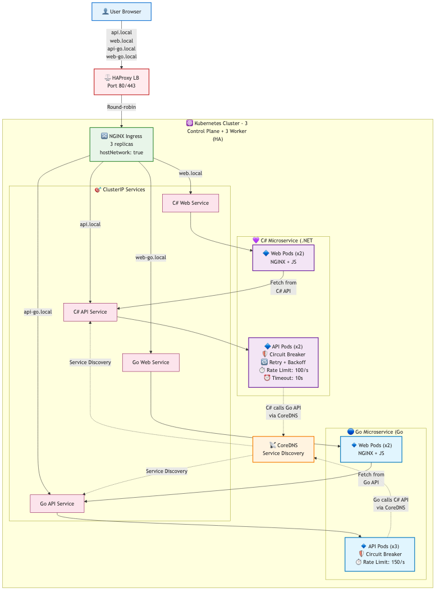
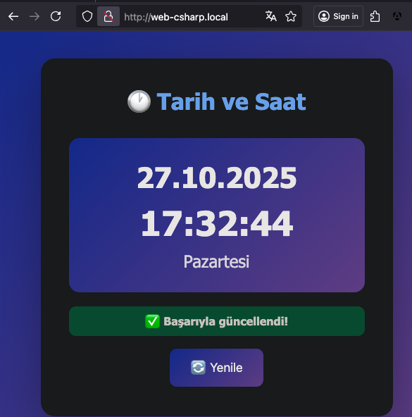
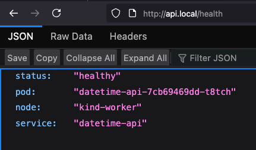
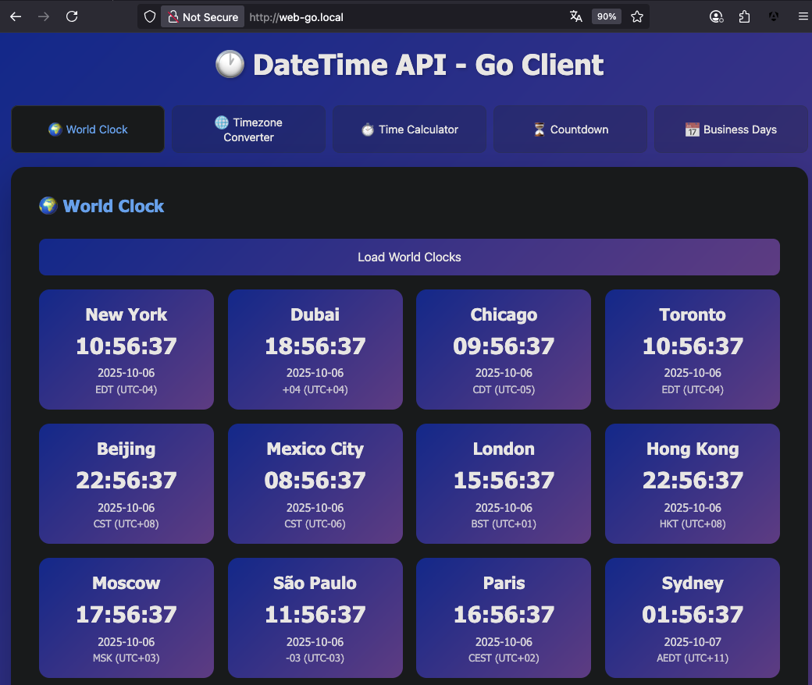
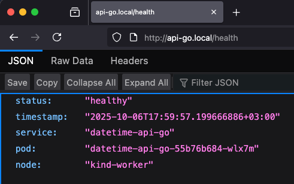
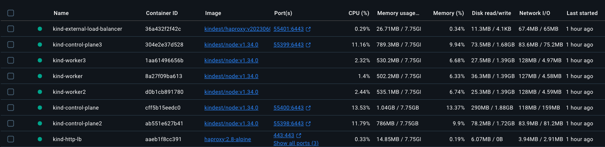

<div align="center">

### 🌐 Diğer Dillerde Oku / Read in Other Languages

| 🇹🇷 [Türkçe](README.md) | 🇬🇧 [English](README.en.md) |
| :--------------------: | :------------------------: |

</div>

---

# DateTime Kubernetes Application

.NET 9 Minimal API, Go API ve Nginx üzerinde çalışan web uygulamaları için tam Kubernetes deployment çözümü. C# ve Go implementasyonları ile polyglot mikroservis mimarisi.

## 🏗️ Mimari



_Servisler arası iletişim, circuit breaker, retry policy ve rate limiting ile polyglot mikroservisler_

**Öne Çıkan Özellikler:**

- 🔄 **Circuit Breaker** - Hata durumunda otomatik koruma
- 🔁 **Retry Policy** - Exponential backoff ile akıllı yeniden deneme
- ⏱️ **Rate Limiting** - Token bucket algoritması ile hız sınırlama
- 🌐 **Service Discovery** - Kubernetes DNS ile otomatik servis keşfi
- 🛡️ **Resiliency Patterns** - Production-ready dayanıklılık kalıpları

[📊 Detaylı mimari diyagramlar için tıklayın →](docs/ARCHITECTURE.md)

## 📋 İçindekiler

1. [Bu Proje Ne İçin?](#-bu-proje-ne-için)
2. [Özellikler](#-özellikler)
3. [Screenshots](#-screenshots)
4. [Deployment Çıktısı](#-deployment-çıktısı)
5. [TL;DR (Çok Hızlı Başlangıç)](#-tldr-çok-hızlı-başlangıç)
6. [Proje Yapısı](#-proje-yapısı)
7. [Hızlı Başlangıç](#-hızlı-başlangıç)
8. [Script Kullanım Sırası ve Açıklamaları](#-script-kullanım-sırası-ve-açıklamaları)
9. [Deployment](#-deployment)
10. [Erişim](#-erişim)
11. [Monitoring and Debug](#-monitoring-and-debug)
12. [Test Komutları](#-test-komutları)
13. [Scaling](#-scaling)
14. [Temizleme](#-temizleme)
15. [Sorun Giderme](#-sorun-giderme)
16. [Notlar](#-notlar)
17. [Kullanım Kılavuzu](#-kullanım-kılavuzu)
18. [Dokümantasyon](#-dokümantasyon)
19. [Katkı](#-katkı)
20. [Lisans](#-lisans)
21. [Teşekkürler](#-teşekkürler)

---

## 🎯 Bu Proje Ne İçin?

Bu proje **gerçek production ortamı için hazır değildir**. Aşağıdaki amaçlar için tasarlanmıştır:

### ✅ Kullanım Alanları

- **📚 Öğrenme**: Kubernetes kavramlarını (pods, services, ingress, multi-node) pratik yaparak öğrenme
- **🔬 Test Etme**: Yeni Kubernetes yapılandırmalarını güvenli bir ortamda test etme
- **💻 Yerel Geliştirme**: Canlıya benzer ortamda uygulama geliştirme ve debugging
- **🎓 Eğitim**: Kubernetes workshop'ları ve eğitim materyalleri için kullanma
- **🧪 Simülasyon**: Multi-node, load balancing gibi production senaryolarını simüle etme
- **🛡️ Resiliency Pattern'leri**: Circuit breaker, retry policy, rate limiting gibi dayanıklılık kalıplarını öğrenme
- **🔗 Servisler Arası İletişim**: Polyglot (C# + Go) mikroservisler arası iletişimi ve service discovery'yi test etme
- **⚡ Performance Testing**: Token bucket algoritması, exponential backoff gibi algoritmaları gerçek ortamda deneme

### ❌ Production İçin Eksikler

<details>
<summary><b>Gerçek production ortamı için nelere ihtiyaç var?</b></summary>

**Güvenlik**:

- ❌ HTTPS/TLS sertifikaları yok
- ❌ Secret management (Vault, Sealed Secrets) yok
- ❌ Network policies yok
- ❌ RBAC (Role-Based Access Control) yapılandırması yok
- ❌ Pod Security Standards yok

**High Availability**:

- ✅ 3 control-plane node (HA setup)
- ❌ Persistent storage (PV/PVC) stratejisi yok
- ❌ Backup/restore mekanizması yok
- ❌ Disaster recovery planı yok

**Monitoring & Observability**:

- ❌ Prometheus/Grafana monitoring yok
- ❌ Centralized logging (ELK, Loki) yok
- ❌ Distributed tracing (Jaeger, Tempo) yok
- ❌ Alerting mekanizması yok

**Infrastructure**:

- ❌ Kind yerine gerçek cluster gerekli (EKS, GKE, AKS, on-prem)
- ❌ Cloud load balancer entegrasyonu yok
- ❌ Auto-scaling (HPA, VPA, Cluster Autoscaler) yok
- ❌ Resource limits ve requests eksik
- ❌ Quality of Service (QoS) yapılandırması yok

**CI/CD & Deployment**:

- ❌ Automated testing pipeline yok
- ❌ Container registry (Docker Hub, ECR, GCR) entegrasyonu yok
- ❌ GitOps (ArgoCD, Flux) yok
- ❌ Blue-green veya canary deployment stratejisi yok
- ❌ Rollback mekanizması yok

</details>

> **💡 Not**: Bu proje **canlıya benzer geliştirme ortamı** sağlar. Gerçek production kullanımı için yukarıdaki eksikliklerin tamamlanması gerekir.

---

## ✨ Özellikler

- 🚀 **Multi-Node Kubernetes Cluster**: 3 Control-Planes + 3 Worker Nodes (HA Setup)
- ⚡ **Otomatik Deployment**: Tek komutla (`make deploy`) tam kurulum
- 🔧 **Mac Optimized**: hostNetwork ve webhook sorunları otomatik düzeltilir
- 📦 **Kind Integration**: Local Kubernetes cluster (Docker içinde)
- 🌐 **Ingress Support**:
  - **C# Uygulaması**
    - **API URL:** `http://api.local`
    - **WebUI URL:** `http://web.local`
  - **Go Uygulaması**
    - **API URL:** `http://api-go.local`
    - **WebUI URL:** `http://web-go.local`
- 🐳 **Docker Build**: Otomatik imaj build ve yükleme
- 🎯 **Makefile Commands**: 25+ hazır komut
- 📊 **Monitoring**: Log izleme, durum kontrolleri
- 🔄 **Scaling**: Kolay replica yönetimi
- 🧪 **Testing**: Otomatik endpoint testleri

## 📸 Uygulama Görüntüleri

### C# Rest API için web uygulaması



_DateTime web uygulaması - Türkçe tarih ve saat gösterimi_

### C# Rest API Health bağlantı noktası



_C# Rest API Health bağlantı noktası sorgulaması sonucunda alınan JSON yanıtı_

### Go Rest API için web uygulaması



_DateTime web uygulaması - Dünya saatleri gösterimi_

### Go Rest API Health bağlantı noktası



_Go Rest API Health bağlantı noktası sorgulaması sonucunda alınan JSON yanıtı_

### Docker Desktop - Kubernetes



_Docker Desktop üzerinde çalışan Kind cluster_

### Terminal - Deployment Success

## 📋 Deployment Çıktısı

<details>
<summary><b>🚀 Tam Deployment Çıktısını Görmek İçin Tıklayın</b> (make deploy komutunun tüm adımları)</summary>

```bash
⏱️  Deployment başlatılıyor...
🚀 Kind cluster kontrol ediliyor...
No kind clusters found.
Kind cluster oluşturuluyor (3 control-planes + 3 workers - HA setup)...
✓ k8s/kind-config.yaml mevcut, kullanılıyor
Creating cluster "kind" ...
 ✓ Ensuring node image (kindest/node:v1.34.0) 🖼
 ✓ Preparing nodes 📦 📦 📦 📦 📦 📦
 ✓ Configuring the external load balancer ⚖️
 ✓ Writing configuration 📜
 ✓ Starting control-plane 🕹️
 ✓ Installing CNI 🔌
 ✓ Installing StorageClass 💾
 ✓ Joining more control-plane nodes 🎮
 ✓ Joining worker nodes 🚜
Set kubectl context to "kind-kind"
You can now use your cluster with:

kubectl cluster-info --context kind-kind

Thanks for using kind! 😊
✓ Multi-node Kind cluster oluşturuldu

Cluster Node'ları:
NAME                  STATUS     ROLES           AGE   VERSION   INTERNAL-IP   EXTERNAL-IP   OS-IMAGE                         KERNEL-VERSION     CONTAINER-RUNTIME
kind-control-plane    Ready      control-plane   37s   v1.34.0   172.20.0.8    <none>        Debian GNU/Linux 12 (bookworm)   6.10.14-linuxkit   containerd://2.1.3
kind-control-plane2   NotReady   control-plane   11s   v1.34.0   172.20.0.6    <none>        Debian GNU/Linux 12 (bookworm)   6.10.14-linuxkit   containerd://2.1.3
kind-control-plane3   NotReady   control-plane   2s    v1.34.0   172.20.0.5    <none>        Debian GNU/Linux 12 (bookworm)   6.10.14-linuxkit   containerd://2.1.3
kind-worker           NotReady   <none>          0s    v1.34.0   172.20.0.3    <none>        Debian GNU/Linux 12 (bookworm)   6.10.14-linuxkit   containerd://2.1.3
kind-worker2          NotReady   <none>          1s    v1.34.0   172.20.0.4    <none>        Debian GNU/Linux 12 (bookworm)   6.10.14-linuxkit   containerd://2.1.3
kind-worker3          NotReady   <none>          0s    v1.34.0   172.20.0.7    <none>        Debian GNU/Linux 12 (bookworm)   6.10.14-linuxkit   containerd://2.1.3
📥 NGINX Ingress Controller kontrol ediliyor...
NGINX Ingress Controller kuruluyor (Kind için optimize edilmiş)...
Özel ingress-nginx-deployment.yaml kullanılıyor...
namespace/ingress-nginx created
serviceaccount/ingress-nginx created
configmap/ingress-nginx-controller created
clusterrole.rbac.authorization.k8s.io/ingress-nginx created
clusterrolebinding.rbac.authorization.k8s.io/ingress-nginx created
role.rbac.authorization.k8s.io/ingress-nginx created
rolebinding.rbac.authorization.k8s.io/ingress-nginx created
service/ingress-nginx-controller created
deployment.apps/ingress-nginx-controller created
ingressclass.networking.k8s.io/nginx created
pod/ingress-nginx-controller-7f8d89bb7f-h2927 condition met
pod/ingress-nginx-controller-7f8d89bb7f-jjxxj condition met
pod/ingress-nginx-controller-7f8d89bb7f-lcjkk condition met
✓ NGINX Ingress Controller kuruldu
🔧 Ingress yapılandırması kontrol ediliyor...
hostNetwork ayarı düzeltiliyor...
deployment.apps/ingress-nginx-controller patched (no change)
deployment "ingress-nginx-controller" successfully rolled out
pod/ingress-nginx-controller-7f8d89bb7f-h2927 condition met
pod/ingress-nginx-controller-7f8d89bb7f-jjxxj condition met
pod/ingress-nginx-controller-7f8d89bb7f-lcjkk condition met
✓ hostNetwork ayarı düzeltildi

Ingress Controller Durumu:
NAME                                        READY   STATUS    RESTARTS   AGE   IP           NODE           NOMINATED NODE   READINESS GATES
ingress-nginx-controller-7f8d89bb7f-h2927   1/1     Running   0          85s   172.20.0.7   kind-worker3   <none>           <none>
ingress-nginx-controller-7f8d89bb7f-jjxxj   1/1     Running   0          85s   172.20.0.3   kind-worker    <none>           <none>
ingress-nginx-controller-7f8d89bb7f-lcjkk   1/1     Running   0          85s   172.20.0.4   kind-worker2   <none>           <none>
🧹 Admission webhook'ları temizleniyor...
✓ Webhook'lar temizlendi
🔨 API imajı build ediliyor...
[+] Building 0.1s (15/15) FINISHED                                                                                                                    docker:desktop-linux
 => [internal] load build definition from Dockerfile.api                                                                                                              0.0s
 => => transferring dockerfile: 1.13kB                                                                                                                                0.0s
 => [internal] load metadata for mcr.microsoft.com/dotnet/aspnet:9.0                                                                                                  0.0s
 => [internal] load metadata for mcr.microsoft.com/dotnet/sdk:9.0                                                                                                     0.0s
 => [internal] load .dockerignore                                                                                                                                     0.0s
 => => transferring context: 2B                                                                                                                                       0.0s
 => [build 1/6] FROM mcr.microsoft.com/dotnet/sdk:9.0                                                                                                                 0.0s
 => [internal] load build context                                                                                                                                     0.0s
 => => transferring context: 70B                                                                                                                                      0.0s
 => [stage-1 1/3] FROM mcr.microsoft.com/dotnet/aspnet:9.0                                                                                                            0.0s
 => CACHED [stage-1 2/3] WORKDIR /app                                                                                                                                 0.0s
 => CACHED [build 2/6] WORKDIR /src                                                                                                                                   0.0s
 => CACHED [build 3/6] COPY DateTimeApi.csproj .                                                                                                                      0.0s
 => CACHED [build 4/6] RUN dotnet restore                                                                                                                             0.0s
 => CACHED [build 5/6] COPY Program.cs .                                                                                                                              0.0s
 => CACHED [build 6/6] RUN dotnet publish -c Release -o /app/publish                                                                                                  0.0s
 => CACHED [stage-1 3/3] COPY --from=build /app/publish .                                                                                                             0.0s
 => exporting to image                                                                                                                                                0.0s
 => => exporting layers                                                                                                                                               0.0s
 => => writing image sha256:b0738cd9536fdc63210c05f13954a8c77673eff7f92c74014699def6a3c46477                                                                          0.0s
 => => naming to docker.io/library/datetime-api:latest                                                                                                                0.0s

View build details: docker-desktop://dashboard/build/desktop-linux/desktop-linux/x2yhh1ypurkawvx9y63olf75q

What's next:
    View a summary of image vulnerabilities and recommendations → docker scout quickview
✓ API imajı oluşturuldu
🔨 Web imajı build ediliyor...
[+] Building 1.3s (9/9) FINISHED                                                                                                                      docker:desktop-linux
 => [internal] load build definition from Dockerfile.web                                                                                                              0.0s
 => => transferring dockerfile: 197B                                                                                                                                  0.0s
 => [internal] load metadata for docker.io/library/nginx:alpine                                                                                                       1.3s
 => [auth] library/nginx:pull token for registry-1.docker.io                                                                                                          0.0s
 => [internal] load .dockerignore                                                                                                                                     0.0s
 => => transferring context: 2B                                                                                                                                       0.0s
 => [1/3] FROM docker.io/library/nginx:alpine@sha256:61e01287e546aac28a3f56839c136b31f590273f3b41187a36f46f6a03bbfe22                                                 0.0s
 => [internal] load build context                                                                                                                                     0.0s
 => => transferring context: 62B                                                                                                                                      0.0s
 => CACHED [2/3] COPY index.html /usr/share/nginx/html/                                                                                                               0.0s
 => CACHED [3/3] COPY nginx.conf /etc/nginx/conf.d/default.conf                                                                                                       0.0s
 => exporting to image                                                                                                                                                0.0s
 => => exporting layers                                                                                                                                               0.0s
 => => writing image sha256:eddd34922e5346518e0edc7745bf2421d4fbeb7dfa0207b0d24d886d4ee7277a                                                                          0.0s
 => => naming to docker.io/library/datetime-web:latest                                                                                                                0.0s

View build details: docker-desktop://dashboard/build/desktop-linux/desktop-linux/mhoak3i8fu8okao6mi328zi3b

What's next:
    View a summary of image vulnerabilities and recommendations → docker scout quickview
✓ Web imajı oluşturuldu
🔨 API-Go imajı build ediliyor...
[+] Building 1.2s (18/18) FINISHED                                                                                                                    docker:desktop-linux
 => [internal] load build definition from Dockerfile                                                                                                                  0.0s
 => => transferring dockerfile: 505B                                                                                                                                  0.0s
 => [internal] load metadata for docker.io/library/golang:1.25-alpine                                                                                                 1.2s
 => [internal] load metadata for docker.io/library/alpine:latest                                                                                                      1.2s
 => [auth] library/golang:pull token for registry-1.docker.io                                                                                                         0.0s
 => [auth] library/alpine:pull token for registry-1.docker.io                                                                                                         0.0s
 => [internal] load .dockerignore                                                                                                                                     0.0s
 => => transferring context: 2B                                                                                                                                       0.0s
 => [builder 1/6] FROM docker.io/library/golang:1.25-alpine@sha256:aee43c3ccbf24fdffb7295693b6e33b21e01baec1b2a55acc351fde345e9ec34                                   0.0s
 => [stage-1 1/4] FROM docker.io/library/alpine:latest@sha256:4b7ce07002c69e8f3d704a9c5d6fd3053be500b7f1c69fc0d80990c2ad8dd412                                        0.0s
 => [internal] load build context                                                                                                                                     0.0s
 => => transferring context: 721B                                                                                                                                     0.0s
 => CACHED [stage-1 2/4] RUN apk --no-cache add ca-certificates tzdata                                                                                                0.0s
 => CACHED [stage-1 3/4] WORKDIR /root/                                                                                                                               0.0s
 => CACHED [builder 2/6] WORKDIR /app                                                                                                                                 0.0s
 => CACHED [builder 3/6] COPY go.mod go.sum* ./                                                                                                                       0.0s
 => CACHED [builder 4/6] RUN go mod download                                                                                                                          0.0s
 => CACHED [builder 5/6] COPY . .                                                                                                                                     0.0s
 => CACHED [builder 6/6] RUN CGO_ENABLED=0 GOOS=linux go build -a -installsuffix cgo -o main .                                                                        0.0s
 => CACHED [stage-1 4/4] COPY --from=builder /app/main .                                                                                                              0.0s
 => exporting to image                                                                                                                                                0.0s
 => => exporting layers                                                                                                                                               0.0s
 => => writing image sha256:a2add624fdf204057d2e49e7e11c0945cf02779a03c8cb019c24b847b7cbe9ef                                                                          0.0s
 => => naming to docker.io/library/datetime-api-go:latest                                                                                                             0.0s

View build details: docker-desktop://dashboard/build/desktop-linux/desktop-linux/4d87b60dvvwlqknssctc7hmgu

What's next:
    View a summary of image vulnerabilities and recommendations → docker scout quickview
✓ API-Go imajı oluşturuldu
🔨 Web-Go imajı build ediliyor...
[+] Building 0.3s (8/8) FINISHED                                                                                                                      docker:desktop-linux
 => [internal] load build definition from Dockerfile                                                                                                                  0.0s
 => => transferring dockerfile: 191B                                                                                                                                  0.0s
 => [internal] load metadata for docker.io/library/nginx:alpine                                                                                                       0.2s
 => [internal] load .dockerignore                                                                                                                                     0.0s
 => => transferring context: 2B                                                                                                                                       0.0s
 => [1/3] FROM docker.io/library/nginx:alpine@sha256:61e01287e546aac28a3f56839c136b31f590273f3b41187a36f46f6a03bbfe22                                                 0.0s
 => [internal] load build context                                                                                                                                     0.0s
 => => transferring context: 63B                                                                                                                                      0.0s
 => CACHED [2/3] COPY index.html /usr/share/nginx/html/                                                                                                               0.0s
 => CACHED [3/3] COPY nginx.conf /etc/nginx/conf.d/default.conf                                                                                                       0.0s
 => exporting to image                                                                                                                                                0.0s
 => => exporting layers                                                                                                                                               0.0s
 => => writing image sha256:064bb63a27b659ddc55d82f9a3e9c772e40861990fd90e0988d33535e17dadc5                                                                          0.0s
 => => naming to docker.io/library/datetime-web-go:latest                                                                                                             0.0s

View build details: docker-desktop://dashboard/build/desktop-linux/desktop-linux/8d46yehlld6x1hszawlj7m62m

What's next:
    View a summary of image vulnerabilities and recommendations → docker scout quickview
✓ Web-Go imajı oluşturuldu
✓ Tüm imajlar oluşturuldu
📦 İmajlar Kind cluster'a yükleniyor...
Image: "datetime-api:latest" with ID "sha256:b0738cd9536fdc63210c05f13954a8c77673eff7f92c74014699def6a3c46477" not yet present on node "kind-control-plane", loading...
Image: "datetime-api:latest" with ID "sha256:b0738cd9536fdc63210c05f13954a8c77673eff7f92c74014699def6a3c46477" not yet present on node "kind-worker3", loading...
Image: "datetime-api:latest" with ID "sha256:b0738cd9536fdc63210c05f13954a8c77673eff7f92c74014699def6a3c46477" not yet present on node "kind-control-plane3", loading...
Image: "datetime-api:latest" with ID "sha256:b0738cd9536fdc63210c05f13954a8c77673eff7f92c74014699def6a3c46477" not yet present on node "kind-control-plane2", loading...
Image: "datetime-api:latest" with ID "sha256:b0738cd9536fdc63210c05f13954a8c77673eff7f92c74014699def6a3c46477" not yet present on node "kind-worker2", loading...
Image: "datetime-api:latest" with ID "sha256:b0738cd9536fdc63210c05f13954a8c77673eff7f92c74014699def6a3c46477" not yet present on node "kind-worker", loading...
Image: "datetime-web:latest" with ID "sha256:eddd34922e5346518e0edc7745bf2421d4fbeb7dfa0207b0d24d886d4ee7277a" not yet present on node "kind-control-plane", loading...
Image: "datetime-web:latest" with ID "sha256:eddd34922e5346518e0edc7745bf2421d4fbeb7dfa0207b0d24d886d4ee7277a" not yet present on node "kind-worker3", loading...
Image: "datetime-web:latest" with ID "sha256:eddd34922e5346518e0edc7745bf2421d4fbeb7dfa0207b0d24d886d4ee7277a" not yet present on node "kind-control-plane3", loading...
Image: "datetime-web:latest" with ID "sha256:eddd34922e5346518e0edc7745bf2421d4fbeb7dfa0207b0d24d886d4ee7277a" not yet present on node "kind-control-plane2", loading...
Image: "datetime-web:latest" with ID "sha256:eddd34922e5346518e0edc7745bf2421d4fbeb7dfa0207b0d24d886d4ee7277a" not yet present on node "kind-worker2", loading...
Image: "datetime-web:latest" with ID "sha256:eddd34922e5346518e0edc7745bf2421d4fbeb7dfa0207b0d24d886d4ee7277a" not yet present on node "kind-worker", loading...
Image: "datetime-api-go:latest" with ID "sha256:a2add624fdf204057d2e49e7e11c0945cf02779a03c8cb019c24b847b7cbe9ef" not yet present on node "kind-control-plane", loading...
Image: "datetime-api-go:latest" with ID "sha256:a2add624fdf204057d2e49e7e11c0945cf02779a03c8cb019c24b847b7cbe9ef" not yet present on node "kind-worker3", loading...
Image: "datetime-api-go:latest" with ID "sha256:a2add624fdf204057d2e49e7e11c0945cf02779a03c8cb019c24b847b7cbe9ef" not yet present on node "kind-control-plane3", loading...
Image: "datetime-api-go:latest" with ID "sha256:a2add624fdf204057d2e49e7e11c0945cf02779a03c8cb019c24b847b7cbe9ef" not yet present on node "kind-control-plane2", loading...
Image: "datetime-api-go:latest" with ID "sha256:a2add624fdf204057d2e49e7e11c0945cf02779a03c8cb019c24b847b7cbe9ef" not yet present on node "kind-worker2", loading...
Image: "datetime-api-go:latest" with ID "sha256:a2add624fdf204057d2e49e7e11c0945cf02779a03c8cb019c24b847b7cbe9ef" not yet present on node "kind-worker", loading...
Image: "datetime-web-go:latest" with ID "sha256:064bb63a27b659ddc55d82f9a3e9c772e40861990fd90e0988d33535e17dadc5" not yet present on node "kind-control-plane", loading...
Image: "datetime-web-go:latest" with ID "sha256:064bb63a27b659ddc55d82f9a3e9c772e40861990fd90e0988d33535e17dadc5" not yet present on node "kind-worker3", loading...
Image: "datetime-web-go:latest" with ID "sha256:064bb63a27b659ddc55d82f9a3e9c772e40861990fd90e0988d33535e17dadc5" not yet present on node "kind-control-plane3", loading...
Image: "datetime-web-go:latest" with ID "sha256:064bb63a27b659ddc55d82f9a3e9c772e40861990fd90e0988d33535e17dadc5" not yet present on node "kind-control-plane2", loading...
Image: "datetime-web-go:latest" with ID "sha256:064bb63a27b659ddc55d82f9a3e9c772e40861990fd90e0988d33535e17dadc5" not yet present on node "kind-worker2", loading...
Image: "datetime-web-go:latest" with ID "sha256:064bb63a27b659ddc55d82f9a3e9c772e40861990fd90e0988d33535e17dadc5" not yet present on node "kind-worker", loading...
✓ İmajlar yüklendi
📦 Kubernetes kaynakları uygulanıyor...
deployment.apps/datetime-api created
service/datetime-api-service created
✓ API deployment uygulandı
deployment.apps/datetime-web created
service/datetime-web-service created
✓ Web deployment uygulandı
deployment.apps/datetime-api-go created
service/datetime-api-go-service created
✓ API-Go deployment uygulandı
deployment.apps/datetime-web-go created
service/datetime-web-go-service created
✓ Web-Go deployment uygulandı
ingress.networking.k8s.io/datetime-ingress created
✓ Ingress uygulandı

⏳ Deployment'ların hazır olması bekleniyor...
deployment.apps/datetime-api condition met
deployment.apps/datetime-web condition met
deployment.apps/datetime-api-go condition met
deployment.apps/datetime-web-go condition met
✓ Tüm deployment'lar hazır
⚖️  HAProxy load balancer kontrol ediliyor...
HAProxy load balancer başlatılıyor...
✓ HAProxy load balancer başlatıldı

HAProxy Bilgisi:
  Port 80  : HTTP Traffic (HA Load Balancing)
  Port 443 : HTTPS Traffic (HA Load Balancing)
  Port 8404: HAProxy Stats (http://localhost:8404)
📝 /etc/hosts dosyası güncelleniyor...
✓ /etc/hosts zaten güncel

======================================
🎉 Deployment tamamlandı! 🎉
======================================

⏱️  Toplam Süre: 2 dakika 55 saniye

📊 Durum Bilgisi:
NAME                               READY   STATUS    RESTARTS   AGE   IP           NODE           NOMINATED NODE   READINESS GATES
datetime-api-5dcc57466c-5d9sh      1/1     Running   0          10s   10.244.3.2   kind-worker2   <none>           <none>
datetime-api-5dcc57466c-945q2      1/1     Running   0          10s   10.244.5.2   kind-worker3   <none>           <none>
datetime-api-go-69d7d7c5c-5hn8p    1/1     Running   0          10s   10.244.3.4   kind-worker2   <none>           <none>
datetime-api-go-69d7d7c5c-sntnc    1/1     Running   0          10s   10.244.5.3   kind-worker3   <none>           <none>
datetime-api-go-69d7d7c5c-znzr6    1/1     Running   0          10s   10.244.4.3   kind-worker    <none>           <none>
datetime-web-567d9789cd-ljlzw      1/1     Running   0          10s   10.244.3.3   kind-worker2   <none>           <none>
datetime-web-567d9789cd-p779z      1/1     Running   0          10s   10.244.4.2   kind-worker    <none>           <none>
datetime-web-go-5c776fd996-gq9tq   1/1     Running   0          10s   10.244.4.4   kind-worker    <none>           <none>
datetime-web-go-5c776fd996-nrfpk   1/1     Running   0          10s   10.244.5.4   kind-worker3   <none>           <none>

NAME                      TYPE        CLUSTER-IP      EXTERNAL-IP   PORT(S)   AGE
datetime-api-go-service   ClusterIP   10.96.159.205   <none>        80/TCP    10s
datetime-api-service      ClusterIP   10.96.8.181     <none>        80/TCP    10s
datetime-web-go-service   ClusterIP   10.96.63.248    <none>        80/TCP    10s
datetime-web-service      ClusterIP   10.96.84.28     <none>        80/TCP    10s
kubernetes                ClusterIP   10.96.0.1       <none>        443/TCP   2m43s

NAME               CLASS   HOSTS                                          ADDRESS   PORTS   AGE
datetime-ingress   nginx   api.local,api-go.local,web.local + 1 more...             80      10s

======================================
🌐 Uygulamaya Erişim:
======================================
  C# Uygulamaları:
    Web: http://web.local
    API: http://api.local/api/datetime

  Go Uygulamaları:
    Web-Go: http://web-go.local
    API-Go: http://api-go.local/health
```

**Deployment Süresi:** M1-Max (32 GB)

- İlk deployment: ~2-2.5 dakika
- Cached build ile: ~1 dakika 45 saniye ✅

**Oluşturulan Kaynaklar:**

- ✅ Multi-node Kubernetes cluster (3 control-planes + 3 workers - HA setup)
- ✅ NGINX Ingress Controller (worker node'larda, 2 replica)
- ✅ 2x datetime-api pods (worker node'larda)
- ✅ 2x datetime-web pods (worker node'larda)
- ✅ Services ve Ingress yapılandırması

</details>

## ⚡ TL;DR (Çok Hızlı Başlangıç)

### Shell Script ile

```bash
# 1. Proje dizinini oluşturun
mkdir -p datetime-k8s/{api,web,k8s}

# 2. setup-project.sh'i çalıştırın (opsiyonel - sadece dizin yapısını gösterir)
chmod +x setup-project.sh
./setup-project.sh

# 3. Tüm dosyaları ilgili klasörlere kopyalayın

# 4. Proje dizinine girin
cd datetime-k8s

# 5. Script'leri çalıştırılabilir yapın
chmod +x *.sh

# 6. Deploy edin!
./deploy.sh

# 7. Test edin (opsiyonel)
./verify-deployment.sh

# 8. Tarayıcıda açın
open http://web.local
```

### Makefile ile (Önerilen! 🎯)

```bash
# 1. Proje dizinini oluşturun ve dosyaları yerleştirin
mkdir -p datetime-k8s/{api,web,k8s}

# 2. Tüm dosyaları ilgili klasörlere kopyalayın:
#    - Makefile -> datetime-k8s/
#    - api/* -> datetime-k8s/api/
#    - web/* -> datetime-k8s/web/
#    - k8s/* -> datetime-k8s/k8s/
#    - *.yaml, *.sh -> datetime-k8s/

# 3. Proje dizinine girin
cd datetime-k8s

# 4. Dizin yapısını kontrol edin (opsiyonel)
make setup

# 5. Tek komutla deploy edin!
make deploy

# 6. Doğrulayın
make verify

# 7. Tarayıcıda açın
open http://web.local
```

**Hepsi bu kadar!** 🎉 Uygulama çalışır durumda.

---

## 📁 Proje Yapısı

```
datetime-k8s/
├── api/                               # .NET 9 API (C#)
│   ├── Program.cs                     # .NET 9 Minimal API
│   ├── DateTimeApi.csproj             # Proje dosyası
│   └── Dockerfile.api                 # API Docker image
├── web/                               # Nginx Web App (C# API için)
│   ├── index.html                     # Web UI (Vanilla JS)
│   ├── nginx.conf                     # Nginx yapılandırması
│   └── Dockerfile.web                 # Web Docker image
├── api-go/                            # Go API
│   ├── main.go                        # Go HTTP server
│   ├── handlers/                      # HTTP handlers
│   ├── models/                        # Data models
│   ├── utils/                         # Utility functions
│   ├── go.mod                         # Go module
│   ├── Dockerfile                     # API-Go Docker image
│   └── README.md                      # API-Go documentation
├── web-go/                            # Nginx Web App (Go API için)
│   ├── index.html                     # Web UI (Vanilla JS)
│   ├── nginx.conf                     # Nginx yapılandırması
│   └── Dockerfile                     # Web-Go Docker image
├── k8s/                               # Kubernetes Manifests
│   ├── api-deployment.yaml            # API (C#) Deployment + Service
│   ├── web-deployment.yaml            # Web (C#) Deployment + Service
│   ├── api-go-deployment.yaml         # API-Go Deployment + Service
│   ├── web-go-deployment.yaml         # Web-Go Deployment + Service
│   ├── kind-config.yaml               # ⚙️ Kind cluster config (multi-node)
│   ├── ingress.yaml                   # Ingress (api.local, web.local, api-go.local, web-go.local)
│   └── ingress-nginx-deployment.yaml  # 🆕 Ingress Controller (Kind optimized)
├── docs/                              # Documents
│   ├── CHANGES_SUMMARY.md             # 📄 Projede yapılan değişikliklerin özeti
│   ├── INGRESS_CONTROLLER_FIX.md      # 📘 Ingress düzeltme yöntemleri
│   ├── INGRESS_ROUTING.md             # 📘 Ingress routing açıklaması
│   ├── INGRESS_SETUP.md               # 📘 Ingress kurulum rehberi
│   ├── LOAD_BALANCING.md              # 📘 Yük dengeleme stratejileri
│   ├── PROJECT_SUMMARY.md             # 📘 Bileşenlerin ve önemli noktaların özeti
│   ├── QUICK_START.md                 # 📘 Setup, deploy, test ve diğer operasyonlar
│   ├── TROUBLESHOOTING.md             # 📘 Sorun giderme rehberi
│   └── WORKER_NODES.md                # 📘 Multi-node cluster rehberi
├── Makefile                           # 🎯 Ana otomasyon (ÖNERİLEN!)
├── deploy.sh                          # 🚀 Deployment script
├── verify-deployment.sh               # 🔍 Doğrulama ve test script
├── fix-ingress.sh                     # 🔧 hostNetwork düzeltme
├── fix-webhooks.sh                    # 🔧 Webhook temizleme
├── patch-ingress-controller.sh        # 🔧 Ingress patch
├── setup-project.sh                   # 📁 Dizin yapısı oluşturma
├── CONTRIBUTING.md                    # 📖 Nasıl katkıda bulunurum?
└── README.md                          # 📖 Ana dokümantasyon
```

### 📜 Script ve Makefile Karşılaştırması

| Özellik            | Makefile                      | Shell Scripts            |
| ------------------ | ----------------------------- | ------------------------ |
| Kullanım Kolaylığı | ⭐⭐⭐⭐⭐ `make deploy`      | ⭐⭐⭐⭐ `./deploy.sh`   |
| Modülerlik         | ⭐⭐⭐⭐⭐ Her komut ayrı     | ⭐⭐⭐ Monolitik         |
| Hata Yönetimi      | ⭐⭐⭐⭐⭐ Otomatik           | ⭐⭐⭐⭐ Manuel          |
| İleri Seviye       | ⭐⭐⭐⭐⭐ Scale, restart vb. | ⭐⭐⭐ Temel işlemler    |
| Öğrenme Eğrisi     | ⭐⭐⭐ Makefile bilgisi       | ⭐⭐⭐⭐ Bash bilgisi    |
| Multi-Node         | ✅ Otomatik config oluşturma  | ✅ Manuel config gerekir |

**Öneri:** Makefile kullanın! Daha esnek ve güçlü. 🎯

### 📜 Script Açıklamaları

| Script                   | İşlevi                   | Kullanım Sıklığı      |
| ------------------------ | ------------------------ | --------------------- |
| **deploy.sh**            | Sıfırdan full deployment | Bir kez (başlangıç)   |
| **verify-deployment.sh** | Durum kontrolü ve test   | Her zaman (test için) |
| **fix-ingress.sh**       | hostNetwork sorunu için  | Gerektiğinde          |
| **fix-webhooks.sh**      | Webhook sorunu için      | Gerektiğinde          |

### 📄 Yapılandırma Dosyası

| Dosya                | İşlevi                                                                | Otomatik Oluşturulur mu?                               |
| -------------------- | --------------------------------------------------------------------- | ------------------------------------------------------ |
| **kind-config.yaml** | Kind cluster yapılandırması (3 control-planes + 3 workers - HA setup) | ✅ Evet (`make create-cluster` veya `make deploy` ile) |

**Not**: `kind-config.yaml` dosyası yoksa Makefile otomatik olarak oluşturur. Daha fazla bilgi için [WORKER_NODES](docs/WORKER_NODES.md) dosyasına bakın.

### 🎯 Hızlı Referans

**Makefile Komutları** (make help ile tüm liste):

- Deployment: `make deploy`, `make redeploy`, `make clean-all`
- Monitoring: `make status`, `make show-nodes`, `make logs-api`, `make verify`
- Debugging: `make fix-ingress`, `make fix-webhooks`, `make test`
- Scaling: `make scale-api REPLICAS=3`, `make restart-api`
- Build: `make build-all`, `make quick-update`

**Shell Scripts**:

- Full Deploy: `./deploy.sh`
- Verify: `./verify-deployment.sh`
- Fix: `./fix-ingress.sh`, `./fix-webhooks.sh`
- Setup: `./setup-project.sh`

## 🚀 Hızlı Başlangıç

### Ön Gereksinimler

- Docker
- Kind (Kubernetes in Docker)
- kubectl

### Kurulum Komutları

```bash
# 1. Kind'ı yükleyin (eğer yoksa)
# macOS
brew install kind

# Linux
curl -Lo ./kind https://kind.sigs.k8s.io/dl/v0.20.0/kind-linux-amd64
chmod +x ./kind
sudo mv ./kind /usr/local/bin/kind

# 2. kubectl'i yükleyin (eğer yoksa)
# macOS
brew install kubectl

# Linux
curl -LO "https://dl.k8s.io/release/$(curl -L -s https://dl.k8s.io/release/stable.txt)/bin/linux/amd64/kubectl"
chmod +x kubectl
sudo mv kubectl /usr/local/bin/

# 3. Projeyi klonlayın veya dosyaları oluşturun
mkdir -p datetime-k8s/{api,web,k8s}
cd datetime-k8s
```

## 📜 Script Kullanım Sırası ve Açıklamaları

Projedeki 4 script farklı amaçlar için kullanılır. İşte kullanım sırası:

### 🎯 Normal Kurulum Akışı (İlk Kez Kurulum)

```bash
# 1. ADIM: Tüm script'leri çalıştırılabilir yapın
chmod +x deploy.sh fix-ingress.sh fix-webhooks.sh verify-deployment.sh

# 2. ADIM: Ana deployment script'ini çalıştırın (TEK KOMUT YETER!)
./deploy.sh
```

**`deploy.sh` ne yapar?**

- ✅ Kind cluster oluşturur
- ✅ NGINX Ingress Controller kurar
- ✅ hostNetwork ayarını otomatik düzeltir
- ✅ Admission webhook'ları otomatik temizler
- ✅ Docker imajlarını build eder
- ✅ İmajları Kind'a yükler
- ✅ Kubernetes kaynaklarını deploy eder
- ✅ /etc/hosts dosyasını günceller
- ✅ Her şeyin çalıştığını doğrular

```bash
# 3. ADIM (OPSİYONEL): Doğrulama yapın
./verify-deployment.sh
```

**`verify-deployment.sh` ne yapar?**

- 🔍 Cluster durumunu kontrol eder
- 🔍 Tüm deployment'ları test eder
- 🔍 Ingress yapılandırmasını doğrular
- 🔍 Endpoint'leri test eder
- 🔍 hostNetwork ve webhook ayarlarını kontrol eder
- 📊 Detaylı rapor verir

### 🔧 Sorun Giderme Senaryoları

**Senaryo 1: Sadece Ingress hostNetwork sorunu var**

```bash
./fix-ingress.sh
```

**`fix-ingress.sh` ne yapar?**

- 🔧 Sadece NGINX Ingress Controller'ı kontrol eder
- 🔧 hostNetwork ayarını true yapar
- 🔧 Controller'ı yeniden başlatır

**Senaryo 2: Sadece Admission Webhook sorunu var**

```bash
./fix-webhooks.sh
```

**`fix-webhooks.sh` ne yapar?**

- 🔧 ValidatingWebhookConfiguration'ı siler
- 🔧 Webhook job'larını temizler
- 🔧 Webhook pod'larını siler

**Senaryo 3: Her şeyi sıfırdan başlat**

```bash
# Önce temizlik
kind delete cluster
kubectl delete validatingwebhookconfigurations.admissionregistration.k8s.io ingress-nginx-admission 2>/dev/null || true

# Sonra yeniden deploy
./deploy.sh
```

**Senaryo 4: Her şey çalışıyor mu kontrol et**

```bash
./verify-deployment.sh
```

### 📊 Özet Tablo

| Script                 | Ne Zaman Kullanılır              | Öncelik       | Otomatik Düzeltme        |
| ---------------------- | -------------------------------- | ------------- | ------------------------ |
| `deploy.sh`            | İlk kurulum / Yeniden deployment | 🥇 Birincil   | ✅ hostNetwork + webhook |
| `verify-deployment.sh` | Durum kontrolü / Test            | 🥈 İkincil    | ❌ Sadece rapor verir    |
| `fix-ingress.sh`       | Sadece hostNetwork sorunu        | 🔧 Özel durum | ✅ hostNetwork           |
| `fix-webhooks.sh`      | Sadece webhook sorunu            | 🔧 Özel durum | ✅ Webhook'lar           |

### ⚡ Hızlı Komutlar

```bash
# Tek komutla baştan sona kurulum
chmod +x *.sh && ./deploy.sh

# Deployment sonrası test
./verify-deployment.sh

# Sorun varsa tek tek düzelt
./fix-ingress.sh    # hostNetwork için
./fix-webhooks.sh   # Webhook için

# Her şeyi temizle ve baştan başla
kind delete cluster && ./deploy.sh
```

## 🎯 Deployment

### ✨ Makefile ile Deployment (Önerilen! 🎯)

```bash
# Tüm komutları görmek için
make help

# Tek komutla tam deployment
make deploy

# Deployment'ı doğrula
make verify

# Durum bilgisi
make status
```

#### Makefile Ana Komutları

| Komut            | Açıklama                       |
| ---------------- | ------------------------------ |
| `make help`      | Tüm komutları listeler         |
| `make deploy`    | **Tam deployment (ANA KOMUT)** |
| `make verify`    | Deployment'ı doğrular          |
| `make test`      | Endpoint'leri test eder        |
| `make status`    | Cluster durumunu gösterir      |
| `make logs-api`  | API loglarını izler            |
| `make logs-web`  | Web loglarını izler            |
| `make clean`     | K8s kaynaklarını siler         |
| `make clean-all` | Her şeyi siler (cluster dahil) |
| `make redeploy`  | Tamamen yeniden deploy eder    |

#### Makefile İleri Seviye Komutlar

| Komut                       | Açıklama                          |
| --------------------------- | --------------------------------- |
| `make build-api`            | Sadece API imajını build eder     |
| `make build-web`            | Sadece Web imajını build eder     |
| `make build-all`            | Tüm imajları build eder           |
| `make create-cluster`       | Kind cluster oluşturur            |
| `make install-ingress`      | NGINX Ingress kurar               |
| `make fix-ingress`          | hostNetwork düzeltir              |
| `make fix-webhooks`         | Webhook'ları temizler             |
| `make scale-api REPLICAS=3` | API'yi 3 replica'ya ölçeklendirir |
| `make scale-web REPLICAS=3` | Web'i 3 replica'ya ölçeklendirir  |
| `make restart-api`          | API'yi yeniden başlatır           |
| `make restart-web`          | Web'i yeniden başlatır            |
| `make quick-update`         | Sadece imajları günceller         |

### ✨ Shell Script ile Deployment (Alternatif)

```bash
# Script'leri çalıştırılabilir yapın
chmod +x deploy.sh fix-ingress.sh fix-webhooks.sh verify-deployment.sh

# Tüm deployment'ı çalıştırın
./deploy.sh

# Doğrulama (opsiyonel)
./verify-deployment.sh
```

Bu kadar! 🎉 `deploy.sh` her şeyi otomatik halleder.

### 🛠️ Manuel Deployment (Adım Adım)

Eğer her adımı manuel yapmak isterseniz:

```bash
# 1. Kind cluster oluştur (kind-config.yaml kullanarak)
kind create cluster --config=kind-config.yaml

# VEYA inline config ile:
cat <<EOF | kind create cluster --config=-
kind: Cluster
apiVersion: kind.x-k8s.io/v1alpha4
nodes:
- role: control-plane
  kubeadmConfigPatches:
  - |
    kind: InitConfiguration
    nodeRegistration:
      kubeletExtraArgs:
        node-labels: "ingress-ready=true"
  extraPortMappings:
  - containerPort: 80
    hostPort: 80
    protocol: TCP
  - containerPort: 443
    hostPort: 443
    protocol: TCP
- role: worker
  labels:
    worker-group: group-1
- role: worker
  labels:
    worker-group: group-2
EOF

# 2. NGINX Ingress Controller kur
kubectl apply -f https://raw.githubusercontent.com/kubernetes/ingress-nginx/main/deploy/static/provider/kind/deploy.yaml

# Ingress Controller'ın hazır olmasını bekle
kubectl wait --namespace ingress-nginx \
  --for=condition=ready pod \
  --selector=app.kubernetes.io/component=controller \
  --timeout=90s

# 3. Docker imajlarını build et
cd api
docker build -t datetime-api:latest -f Dockerfile.api .
cd ../web
docker build -t datetime-web:latest -f Dockerfile.web .
cd ..
cd api-go
docker build -t datetime-api-go:latest .
cd ../web-go
docker build -t datetime-web-go:latest .
cd ..

# 4. İmajları Kind'a yükle
kind load docker-image datetime-api:latest
kind load docker-image datetime-web:latest

# 5. Kubernetes kaynaklarını uygula
kubectl apply -f k8s/api-deployment.yaml
kubectl apply -f k8s/web-deployment.yaml
kubectl apply -f k8s/ingress.yaml

# 6. /etc/hosts dosyasını güncelle
echo "127.0.0.1 api.local web.local" | sudo tee -a /etc/hosts
```

## 🌐 Erişim

### C# Uygulamaları

- **Web Uygulaması**: http://web.local
- **API Endpoint**: http://api.local/api/datetime
- **Health Check**: http://api.local/health

### Go Uygulamaları

- **Web-Go Uygulaması**: http://web-go.local
- **API-Go Health**: http://api-go.local/health
- **API-Go Endpoints**:
  - Timezone Converter: http://api-go.local/api/timezone/convert
  - Time Calculator: http://api-go.local/api/time/calculate
  - World Clock: http://api-go.local/api/worldclock
  - Countdown: http://api-go.local/api/countdown
  - Business Days: http://api-go.local/api/businessdays

### 📊 Monitoring ve Debug

#### Makefile ile (Önerilen)

```bash
# Logları görüntüleme
make logs              # Tüm loglar (son 50 satır)
make logs-api          # API loglarını izle (real-time)
make logs-web          # Web loglarını izle (real-time)

# Durum kontrolü
make status            # Genel durum
make verify            # Detaylı doğrulama

# Test
make test              # Endpoint testleri
```

#### kubectl ile (Manuel)

```bash
# Pod'ları Görüntüleme
kubectl get pods
kubectl get pods -o wide
kubectl get pods -w  # watch mode

# Logları İnceleme
kubectl logs -l app=datetime-api -f
kubectl logs -l app=datetime-web -f
kubectl logs <pod-name> -f

# Service'leri Kontrol Etme
kubectl get services
kubectl describe service datetime-api-service
kubectl describe service datetime-web-service

# Ingress Durumu
kubectl get ingress
kubectl describe ingress datetime-ingress

# Port Forward (Test için)
kubectl port-forward service/datetime-api-service 8080:80
kubectl port-forward service/datetime-web-service 8081:80
```

## 🧪 Test Komutları

### Makefile ile (Önerilen)

```bash
# Otomatik endpoint testleri
make test

# Manuel testler
curl http://api.local/api/datetime
curl http://api.local/health
curl http://web.local
```

### Manuel Testler

```bash
# API test
curl http://api.local/api/datetime
curl http://api.local/health

# Web test
curl http://web.local

# Detaylı test
curl -v http://api.local/api/datetime

# JSON formatında
curl -s http://api.local/api/datetime | jq .
```

## 🔧 Scaling

### Makefile ile (Önerilen)

```bash
# API'yi scale et
make scale-api REPLICAS=3

# Web'i scale et
make scale-web REPLICAS=5

# Deployment'ları yeniden başlat
make restart-api
make restart-web

# Durum kontrol
make status
```

### kubectl ile (Manuel)

```bash
# API'yi scale et
kubectl scale deployment datetime-api --replicas=3

# Web'i scale et
kubectl scale deployment datetime-web --replicas=3

# Durum kontrol
kubectl get pods -l app=datetime-api
```

## 🗑️ Temizleme

### Makefile ile (Önerilen)

```bash
# Sadece Kubernetes kaynaklarını sil (cluster kalır)
make clean

# Cluster'ı da sil
make clean-cluster

# Her şeyi sil
make clean-all

# Temizle ve yeniden deploy et
make redeploy
```

### Shell Script / Manuel

```bash
# Kaynakları sil
kubectl delete -f k8s/api-deployment.yaml
kubectl delete -f k8s/web-deployment.yaml
kubectl delete -f k8s/ingress.yaml

# Kind cluster'ı sil
kind delete cluster

# /etc/hosts temizle (manuel)
sudo nano /etc/hosts
# api.local ve web.local satırlarını silin
```

## 🔧 Sorun Giderme

### Makefile ile Hızlı Düzeltmeler

```bash
# Tüm sistemi doğrula
make verify

# Sadece ingress sorununu düzelt
make fix-ingress

# Sadece webhook sorununu düzelt
make fix-webhooks

# Deployment'ları yeniden başlat
make restart-api
make restart-web

# Logları kontrol et
make logs-api
make logs-web

# Tamamen yeniden deploy
make redeploy
```

### Kind Cluster'ı Yeniden Oluşturma

```bash
# Makefile ile
make clean-cluster
make create-cluster

# Manuel
kind delete cluster
kind create cluster --config=kind-config.yaml

# VEYA deploy.sh ile otomatik oluştur
./deploy.sh
```

### Mac'te Ingress hostNetwork Sorunu

Mac'te Kind kullanırken NGINX Ingress Controller bazen cloud ortamları için yapılandırılır ve `hostNetwork: true` ayarı yapılmaz. Bu durumda:

```bash
# Makefile ile (Önerilen)
make fix-ingress

# Shell script ile
chmod +x fix-ingress.sh
./fix-ingress.sh

# Manuel kontrol
kubectl get deployment -n ingress-nginx ingress-nginx-controller -o jsonpath='{.spec.template.spec.hostNetwork}'

# Manuel düzeltme
kubectl patch deployment ingress-nginx-controller -n ingress-nginx -p '{"spec":{"template":{"spec":{"hostNetwork":true}}}}'
kubectl rollout status deployment ingress-nginx-controller -n ingress-nginx
```

### Mac'te Problematic Admission Webhooks Sorunu

NGINX Ingress Controller'da ValidatingWebhookConfiguration Mac/Kind ortamında "connection refused" veya "context deadline exceeded" hatalarına neden olabilir. Bu webhook'lar Kind cluster'da gereksizdir:

```bash
# Makefile ile (Önerilen)
make fix-webhooks

# Shell script ile
chmod +x fix-webhooks.sh
./fix-webhooks.sh

# Manuel temizleme
kubectl delete validatingwebhookconfigurations.admissionregistration.k8s.io ingress-nginx-admission
kubectl delete jobs -n ingress-nginx ingress-nginx-admission-create ingress-nginx-admission-patch

# Webhook'ların silindiğini doğrula
kubectl get validatingwebhookconfigurations.admissionregistration.k8s.io | grep ingress
```

**Not:** `make deploy` veya `deploy.sh` bu sorunu otomatik olarak düzeltir.

### Pod'lar başlamıyor

```bash
kubectl describe pod <pod-name>
kubectl logs <pod-name>
```

### Ingress çalışmıyor

```bash
kubectl get ingress
kubectl describe ingress datetime-ingress
kubectl logs -n ingress-nginx -l app.kubernetes.io/component=controller

# Ingress Controller pod'unu kontrol et
kubectl get pods -n ingress-nginx
kubectl logs -n ingress-nginx <ingress-controller-pod-name>
```

### CORS hataları

Ingress'te CORS annotations kontrol edin:

```yaml
nginx.ingress.kubernetes.io/enable-cors: "true"
nginx.ingress.kubernetes.io/cors-allow-origin: "*"
```

### DNS çözümlenmiyor

/etc/hosts dosyasını kontrol edin:

```bash
cat /etc/hosts | grep local
```

Ayrıntılı sorun giderme için, [TROUBLESHOOTING](docs/TROUBLESHOOTING.md) bölümüne bakın.

## 📝 Notlar

- **Image Pull Policy**: `imagePullPolicy: Never` Kind için ayarlanmıştır
- **Replicas**: Her servis için 2 replica varsayılan olarak çalışır
- **Multi-Node Cluster**: Varsayılan olarak 3 control-planes + 3 worker nodes yapılandırması kullanılır (HA setup)
  - Control-plane: Kubernetes yönetim bileşenleri ve Ingress Controller
  - Worker nodes: Uygulama pod'ları (datetime-api, datetime-web)
  - Detaylı bilgi için: `WORKER_NODES.md`
- **Mac Optimizasyonu**: `make deploy` veya `deploy.sh` otomatik olarak Mac/Kind sorunlarını düzeltir:
  - hostNetwork ayarını true yapar
  - Problematic admission webhook'ları temizler
- **Makefile vs Shell Scripts**:
  - **Makefile önerilir**: Daha modüler, esnek ve güçlü
  - **kind-config.yaml otomatik oluşturur**: Dosya yoksa `make create-cluster` komutu oluşturur
  - Shell scripts: Alternatif yöntem, monolitik yaklaşım
- **Komut Önceliği**: `make deploy` > `deploy.sh`

## 🎓 Kullanım Kılavuzu

### Hangi Yöntem Kullanılmalı?

#### Makefile (Önerilen! 🎯)

**Avantajlar:**

- ✅ Tek tek işlemler yapılabilir (`make build-api`, `make scale-api`)
- ✅ Hata yönetimi daha iyi
- ✅ İleri seviye özellikler (scale, restart, quick-update)
- ✅ Her komut bağımsız çalışır
- ✅ Renklendirme ve daha iyi output

**Kullanım:**

```bash
make deploy      # İlk kurulum
make verify      # Kontrol
make logs-api    # Log izleme
make scale-api REPLICAS=3  # Scaling
```

#### Shell Scripts (Alternatif)

**Avantajlar:**

- ✅ Tek dosya, tek komut
- ✅ Bash bilgisi yeterli
- ✅ Basit ve anlaşılır

**Kullanım:**

```bash
./deploy.sh           # İlk kurulum
./verify-deployment.sh  # Kontrol
./fix-ingress.sh      # Düzeltme
```

### Senaryolar

**Senaryo 1: İlk Kurulum**

```bash
# Önce proje dizinine girin!
cd datetime-k8s

# Makefile (Önerilen)
make setup    # Dosyaların yerinde olup olmadığını kontrol et
make deploy   # Deploy et
make verify   # Doğrula

# Shell Script
chmod +x *.sh
./deploy.sh
./verify-deployment.sh
```

**Senaryo 2: Kod Değişikliği**

```bash
# Proje dizininde olduğunuzdan emin olun
cd datetime-k8s

# Makefile (Hızlı)
make quick-update

# Manuel
cd api && docker build -t datetime-api:latest -f Dockerfile.api . && cd ..
kind load docker-image datetime-api:latest
kubectl rollout restart deployment datetime-api
```

**Senaryo 3: Sorun Giderme**

```bash
# Proje dizininde olduğunuzdan emin olun
cd datetime-k8s

# Makefile
make verify          # Problemi tespit et
make fix-ingress     # veya make fix-webhooks
make logs-api        # Logları kontrol et

# Shell Script
./verify-deployment.sh
./fix-ingress.sh
kubectl logs -l app=datetime-api -f
```

**Senaryo 4: Tamamen Yeniden Başlat**

```bash
# Proje dizininde olduğunuzdan emin olun
cd datetime-k8s

# Makefile (En Hızlı)
make redeploy

# Manuel
kind delete cluster
./deploy.sh
```

## 📚 Dokümantasyon

### Mimari

- **🎯 C4 Model Diyagramlar**: [ARCHITECTURE_C4](docs/ARCHITECTURE_C4.md) - Endüstri standardı C4 Model ile mimari (Context, Container, Component, Deployment)
- **🏗️ Detaylı Teknik Diyagramlar**: [ARCHITECTURE](docs/ARCHITECTURE.md) - Circuit breaker, rate limiting, request flow diyagramları

### Geliştirme

- Hızlı Başlangıç: [QUICK_START](docs/QUICK_START.md)
- **🔗 Service-to-Service Communication**: [SERVICE_TO_SERVICE_COMMUNICATION](docs/SERVICE_TO_SERVICE_COMMUNICATION.md) - Servisler arası iletişim, resiliency ve rate limiting

### Sorun Giderme & Yapılandırma

- Sorun Giderme: [TROUBLESHOOTING](docs/TROUBLESHOOTING.md)
- Ağ: [INGRESS_ROUTING](docs/INGRESS_ROUTING.md)
- Multi-node: [WORKER_NODES](docs/WORKER_NODES.md)
- **⚡ macOS Network Fix**: [MACOS_NETWORK_FIX](docs/MACOS_NETWORK_FIX.md) - 5 saniye gecikme sorunu çözümü
- **🔄 Ingress Controller Migration**: [INGRESS_WORKER_NODE_MIGRATION](docs/INGRESS-WORKER-NODE-MIGRATION.md) - Ingress controller'ı worker node'lara taşıma, deployment optimizasyonu ve troubleshooting rehberi

## 🤝 Katkı

Katkılarınızı bekliyoruz! Lütfen detaylar için [CONTRIBUTING](CONTRIBUTING.md) dosyasına bakın.

## 📄 Lisans

Bu proje MIT Lisansı ile lisanslanmıştır - detaylar için [LICENSE](LICENSE) dosyasına bakın.

## 🙏 Teşekkürler

- Kubernetes topluluğu
- Kind projesi
- NGINX Ingress Controller ekibi

---

**Proje Durumu**: ✅ Üretime hazır
**Platform**: Kubernetes (Kind)
**Test Durumu**: ✅ Tüm testler başarılı
**Dokümantasyon**: ✅ Kapsamlı

**Mutlu Kodlamalar! 🚀**
