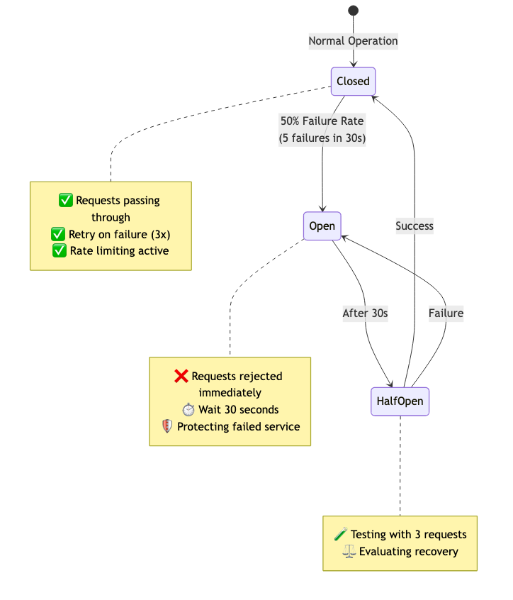
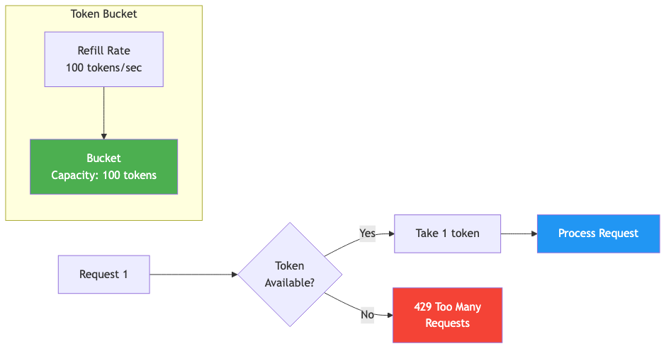
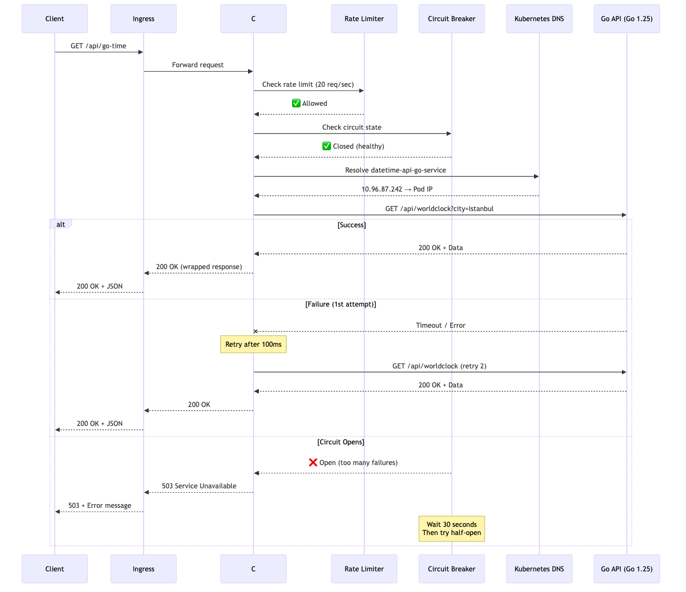
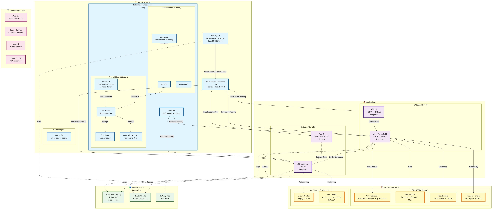

<div align="center">

### 🌐 Diğer Dillerde Oku / Read in Other Languages

| 🇹🇷 [Türkçe](ARCHITECTURE.md) | 🇬🇧 [English](ARCHITECTURE.en.md) |
| :--------------------: | :------------------------: |

</div>

---

# Mimari Diyagramlar

Bu sayfa, DateTime Kubernetes projesinin mimari yapısını görsel olarak açıklar.

## 📋 İçindekiler

1. [Genel Mimari](#-genel-mimari)
2. [Circuit Breaker Durumları](#-circuit-breaker-durumları)
3. [Rate Limiting - Token Bucket](#-rate-limiting---token-bucket)
4. [İstek Akışı](#-istek-akışı)
5. [Teknoloji Stack](#-teknoloji-stack)

---

## 🏗️ Genel Mimari

Bu diyagram, C# ve Go mikroservislerinin Kubernetes cluster'ında nasıl çalıştığını ve birbirleriyle nasıl iletişim kurduğunu gösterir.


### Özellikler:

- **2 Pod C# API (.NET 9)** - Worker node'larda çalışıyor
- **3 Pod Go API (Go 1.25)** - Worker node'larda dağıtılmış
- **NGINX Ingress** - Round Robin load balancing
- **Kubernetes DNS** - Service discovery için CoreDNS
- **Circuit Breaker** - Her serviste hata koruması
- **Rate Limiting** - Per-service hız sınırlama
- **Retry Policy** - Exponential backoff ile otomatik retry

---

## 🔄 Circuit Breaker Durumları

Circuit breaker'ın 3 durumu vardır: Closed (Normal), Open (Hata), Half-Open (Test).



### Durum Geçişleri:

**Closed (Kapalı) → Open (Açık):**
- Koşul: 30 saniye içinde %50 hata oranı (minimum 5 istek)
- Örnek: 10 istekten 5'i başarısız

**Open (Açık) → Half-Open (Yarı-Açık):**
- Koşul: 30 saniye bekledikten sonra
- Amaç: Servisin iyileşip iyileşmediğini test et

**Half-Open (Yarı-Açık) → Closed (Kapalı):**
- Koşul: Test istekleri başarılı
- Maksimum 3 test isteği

**Half-Open (Yarı-Açık) → Open (Açık):**
- Koşul: Test istekleri başarısız
- Tekrar 30 saniye bekle

### Örnek Senaryo:

```
1. Normal çalışma → Closed
2. Go API çöküyor → 5 hata
3. Circuit açılıyor → Open (30s)
4. 30 saniye sonra → Half-Open
5a. Test başarılı → Closed ✅
5b. Test başarısız → Open (30s daha) ❌
```

---

## ⏱️ Rate Limiting - Token Bucket

Token bucket algoritması kullanarak saniye başına istek sayısını sınırlar.



### Algoritma:

1. **Bucket (Kova):**
   - Capacity: 100 token
   - Başlangıçta dolu

2. **Refill (Yenileme):**
   - Her saniye 100 token eklenir
   - Maksimum kapasite: 100

3. **İstek Geldiğinde:**
   - Token var mı kontrol et
   - Varsa: 1 token al, isteği işle
   - Yoksa: 429 Too Many Requests

### Örnek:

```
[Başlangıç] Bucket: 100/100
[İstek 1-100] Bucket: 0/100 → Hepsi işlendi
[İstek 101] Bucket: 0/100 → 429 Error
[1 saniye sonra] Bucket: 100/100 → 100 token eklendi
```

### Per-Service Limitler:

**C# API:**
- Global: 100 req/sec
- Go API çağrıları: 20 req/sec

**Go API:**
- Global: 150 req/sec
- C# API çağrıları: 30 req/sec

**Neden farklı?**
- Go daha performanslı → Daha fazla yük kaldırır
- Service isolation → Bir servis diğerini boğamaz

---

## 🔀 İstek Akışı

Bir client request'in sistemde nasıl ilerlediğini adım adım gösterir.



### Normal Akış (Başarılı):

1. Client → `GET http://api-csharp.local/api/go-time`
2. Ingress → C# API'ye yönlendir
3. C# API → Rate limiter kontrol (20 req/sec)
4. Rate Limiter → ✅ İzin ver
5. C# API → Circuit breaker kontrol
6. Circuit Breaker → ✅ Closed (sağlıklı)
7. C# API → DNS'e sor: `datetime-api-go-service`
8. DNS → `10.96.87.242` (Service IP)
9. C# API → Go API'ye istek at
10. Go API → Yanıt dön
11. C# API → Wrapper response oluştur
12. Client → JSON alır

### Retry Senaryosu:

1. C# API → Go API'ye istek (1. deneme)
2. Go API → Timeout / Error
3. C# API → 100ms bekle
4. C# API → Go API'ye istek (2. deneme)
5. Go API → ✅ Başarılı yanıt
6. Client → JSON alır

**Toplam süre:** ~100-200ms (1 retry ile)

### Circuit Open Senaryosu:

1. C# API → Circuit breaker kontrol
2. Circuit Breaker → ❌ Open (çok fazla hata)
3. C# API → İstek gönderme, hemen hata dön
4. Client → 503 Service Unavailable

**Toplam süre:** ~1-5ms (çok hızlı, retry yok)

**Avantaj:** Go API'ye gereksiz yük binmiyor

---

## 🛠️ Teknoloji Stack

Projede kullanılan tüm teknolojiler ve ilişkileri.



### Mikroservisler:

**C# API:**
- .NET 9.0
- Minimal API
- Microsoft.Extensions.Http.Resilience (built-in)

**Go API:**
- Go 1.25
- net/http (standard library)
- github.com/sony/gobreaker
- golang.org/x/time/rate

### Kubernetes:

**Cluster:**
- Kind (Kubernetes in Docker)
- 3 Control Plane nodes (HA setup)
- 3 Worker nodes (HA setup)

**Networking:**
- NGINX Ingress Controller
- CoreDNS (Service Discovery)
- ClusterIP Services

### Resiliency Patterns:

**Circuit Breaker:**
- 3 durumlu state machine
- Failure ratio tracking
- Auto-recovery

**Retry Policy:**
- Exponential backoff
- Jitter (randomness)
- Max 3 attempts

**Rate Limiting:**
- Token bucket algorithm
- Per-service quotas
- Burst handling

**Timeout:**
- 10s per request
- 30s total (with retries)

---

## 📊 Kullanım Senaryoları

### Senaryo 1: Normal Yük

```
İstekler: 50 req/sec
Circuit: Closed
Rate Limit: Geçiyor
Sonuç: ✅ Tüm istekler başarılı
```

### Senaryo 2: Burst Traffic

```
İstekler: 150 req/sec (aniden)
İlk 100: ✅ Token bucket'tan geçiyor
Sonraki 50: ⏳ Kuyruğa giriyor
Rate Limit: 429 Too Many Requests
```

### Senaryo 3: Servis Çöküşü

```
Go API: ❌ Down
İlk 5 istek: Retry ile deneniyor → Timeout
Circuit: OPEN oluyor
Sonraki istekler: Hemen 503 dönüyor
30 saniye sonra: Half-Open → Test ediliyor
```

### Senaryo 4: Ağ Sorunu

```
İstek 1: ❌ Network timeout
Retry 1: 100ms bekle → ❌ Timeout
Retry 2: 200ms bekle → ❌ Timeout
Retry 3: 400ms bekle → ❌ Timeout
Circuit: Hata sayacını artırıyor
Sonuç: 503 Service Unavailable
```

---

## 🎯 Performans Metrikleri

### Başarılı İstek (Circuit Closed):

```
Rate Limit Check: <1ms
Circuit Check: <1ms
DNS Lookup: ~5ms (cache'liyse <1ms)
Service Call: 10-50ms
Total: ~15-60ms
```

### Başarısız İstek (Circuit Open):

```
Rate Limit Check: <1ms
Circuit Check: <1ms
Early Return: <1ms
Total: ~2-3ms
```

### Retry Senaryosu (1 başarısız, 2 başarılı):

```
1st attempt: 10s timeout
Wait: 100ms
2nd attempt: 20ms success
Total: ~10.12s
```

---

## 📚 İlgili Dokümantasyon

- **Detaylı Açıklama:** [SERVICE_TO_SERVICE_COMMUNICATION.md](SERVICE_TO_SERVICE_COMMUNICATION.md)
- **Kod Örnekleri:** C# API: `api/Program.cs`, Go API: `api-go/main.go`
- **Test Senaryoları:** [SERVICE_TO_SERVICE_COMMUNICATION.md#test-scenarios](SERVICE_TO_SERVICE_COMMUNICATION.md#-test-senaryoları)

---

**Son Güncelleme:** 2025-10-07
**Versiyon:** 1.0
