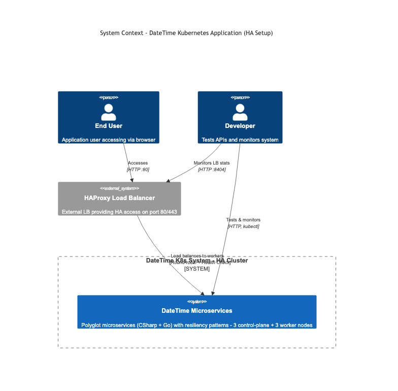
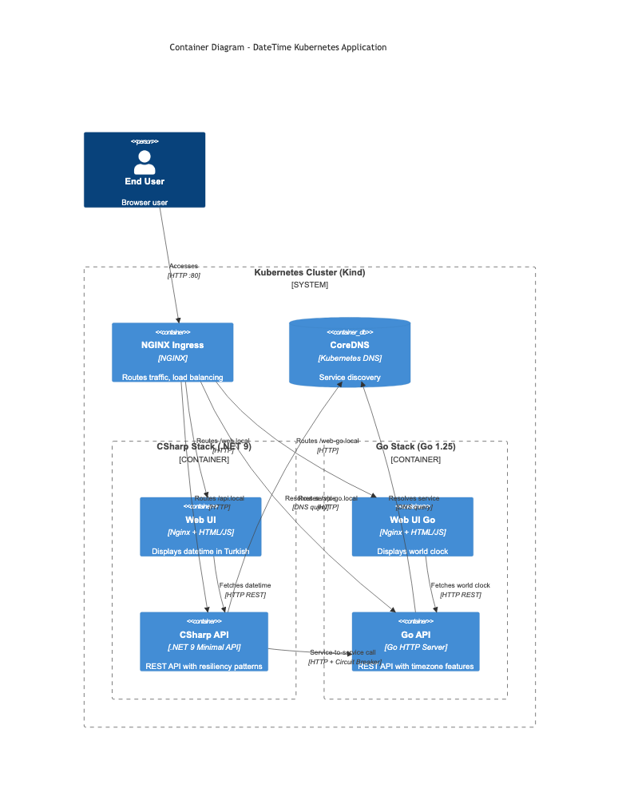
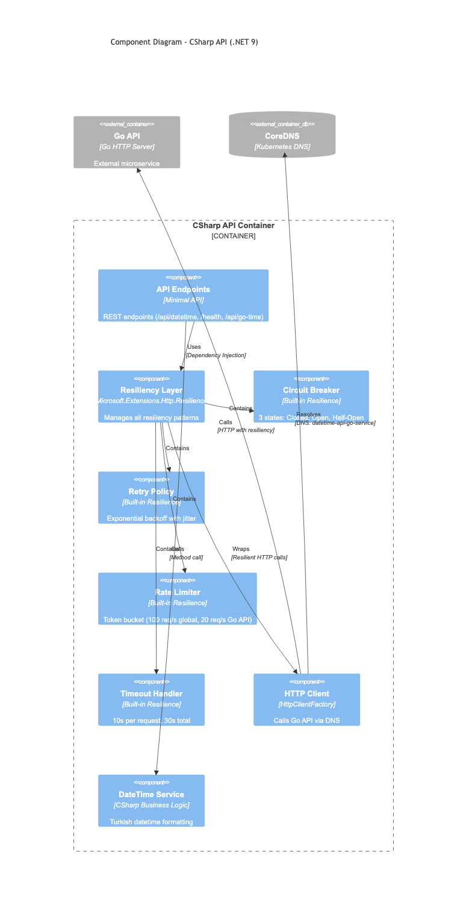
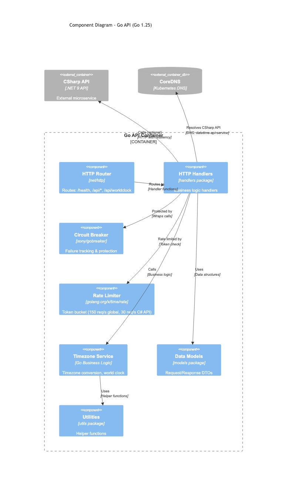
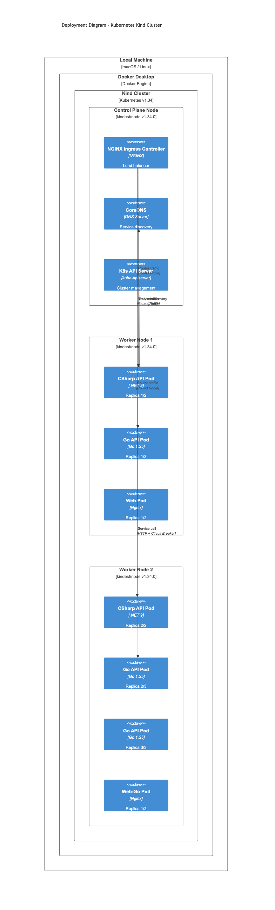

<div align="center">

### 🌐 Read in Other Languages

| 🇹🇷 [Türkçe](ARCHITECTURE_C4.md) | 🇬🇧 [English](ARCHITECTURE_C4.en.md) |
| :--------------------: | :------------------------: |

</div>

---

# C4 Model - Architecture Diagrams

This page explains the architecture of the DateTime Kubernetes project using the **C4 Model** standard.

## 📋 Table of Contents

1. [What is C4 Model?](#-what-is-c4-model)
2. [Level 1: System Context](#-level-1-system-context)
3. [Level 2: Container Diagram](#-level-2-container-diagram)
4. [Level 3: Component - CSharp API](#-level-3-component---csharp-api)
5. [Level 3: Component - Go API](#-level-3-component---go-api)
6. [Deployment Diagram](#-deployment-diagram)
7. [Why C4 Model?](#-why-c4-model)
8. [Other Architecture Diagrams](#-other-architecture-diagrams)

---

## 🎯 What is C4 Model?

**C4 Model** is an approach to visualize software architecture at 4 different abstraction levels:

- **Level 1 - Context**: System and its environment (users, external systems)
- **Level 2 - Container**: Technology choices (API, Web, Database)
- **Level 3 - Component**: Components inside containers
- **Level 4 - Code**: UML class diagram (optional)

**Additionally:**
- **Deployment**: How the system is deployed in infrastructure

### Target Audience

| Level | Target Audience | Detail Level |
|--------|----------------|--------------|
| **Context** | CEO, CTO, Customer | Big picture - Who uses it? |
| **Container** | Architect, DevOps | Technology stack |
| **Component** | Developer, Tech Lead | Internal structure, patterns |
| **Deployment** | DevOps, SRE | Infrastructure, nodes |

---

## 🌍 Level 1: System Context

**Purpose:** Shows the big picture of the system. Who uses it? What external systems does it interact with?



### Description

**Users:**
- **End User**: End user accessing the application via browser
- **Developer**: Developer testing APIs and monitoring the system

**System:**
- **DateTime Microservices**: Polyglot microservices written in CSharp and Go
- **Resiliency Patterns**: Circuit breaker, retry, rate limiting

**Relationships:**
- End User → Accesses system via HTTP/HTTPS
- Developer → Tests and monitors via HTTP and kubectl

### Notes
- **No technical details** at this level
- **Business value** focused
- Ideal for stakeholder presentations

---

## 📦 Level 2: Container Diagram

**Purpose:** Shows the technology choices and how containers communicate.



### Description

**Kubernetes Cluster (Kind):**

**1. NGINX Ingress Controller**
- Traffic routing
- Round Robin load balancing
- Host-based routing (api-csharp.local, web-csharp.local, api-go.local, web-go.local)

**2. CSharp Stack (.NET 9)**
- **Web UI**: Nginx + HTML/JS (Turkish date display)
- **CSharp API**: .NET 9 Minimal API (with resiliency patterns)

**3. Go Stack (Go 1.25)**
- **Web UI Go**: Nginx + HTML/JS (World clocks)
- **Go API**: Go HTTP Server (Timezone features)

**4. CoreDNS**
- Service discovery
- Kubernetes DNS

### Communication Flow

```
User → Ingress → CSharp Web → CSharp API
                              ↓
User → Ingress → Go Web → Go API
                    ↑
CSharp API ────────┘ (Service-to-service + Circuit Breaker)
```

### Notes
- **Container** ≠ Docker container
- Container = Runnable/deployable unit
- Each container can use different technology

---

## 🔧 Level 3: Component - CSharp API

**Purpose:** Shows components inside CSharp API and resiliency patterns.



### Components

**1. API Endpoints (Minimal API)**
- `/api/datetime` - Turkish date/time
- `/health` - Health check
- `/api/go-time` - Fetch data from Go API

**2. Resiliency Layer (Microsoft.Extensions.Http.Resilience)**
- Manages all resiliency patterns
- Integrated via Dependency Injection

**3. Circuit Breaker**
- 3 states: Closed, Open, Half-Open
- 50% failure in 30 seconds → Open
- After 30 seconds → Half-Open (test)

**4. Retry Policy**
- Exponential backoff
- Jitter (randomness)
- Max 3 attempts

**5. Rate Limiter**
- Token bucket algorithm
- Global: 100 req/sec
- Go API: 20 req/sec

**6. Timeout Handler**
- Per request: 10s
- Total (with retries): 30s

**7. HTTP Client (HttpClientFactory)**
- Calls Go API via DNS
- Resilient HTTP calls

**8. DateTime Service**
- Turkish date formatting
- Business logic

### Flow

```
Endpoints → Resiliency Layer → HTTP Client → DNS → Go API
         ↘ DateTime Service (local logic)
```

---

## 🚀 Level 3: Component - Go API

**Purpose:** Shows components inside Go API and resiliency patterns.



### Components

**1. HTTP Router (net/http)**
- `/health` - Health check
- `/api-csharp/*` - API endpoints
- `/api/worldclock` - World clocks

**2. HTTP Handlers**
- Business logic handlers
- handlers package

**3. Circuit Breaker (sony/gobreaker)**
- Failure tracking
- Protection

**4. Rate Limiter (golang.org/x/time/rate)**
- Token bucket
- Global: 150 req/sec
- CSharp API: 30 req/sec

**5. Timezone Service**
- Timezone conversion
- World clock business logic

**6. Data Models**
- Request/Response DTOs
- models package

**7. Utilities**
- Helper functions
- utils package

### Flow

```
Router → Handlers → Circuit Breaker → Timezone Service
              ↓         ↓
         Rate Limiter   Models
              ↓
         DNS → CSharp API (optional)
```

---

## 🏗️ Deployment Diagram

**Purpose:** Shows how the system is deployed in Kubernetes infrastructure.



### Infrastructure Hierarchy

```
Local Machine (macOS/Linux)
├── HAProxy Load Balancer (Docker Container)
│   ├── Port 80/443 - HTTP/HTTPS traffic
│   └── Port 8404 - Stats dashboard
└── Docker Desktop
    └── Kind Cluster (Kubernetes v1.34 - HA Setup)
        ├── Control Plane Nodes (HA - 3 Nodes)
        │   ├── Control Plane 1 (API Server, etcd 1/3)
        │   ├── Control Plane 2 (API Server, etcd 2/3)
        │   └── Control Plane 3 (API Server, etcd 3/3, CoreDNS)
        ├── Worker Node 1 (ingress-ready=true)
        │   ├── NGINX Ingress Controller (1/3 - hostNetwork:true)
        │   ├── CSharp API Pod (1/2)
        │   ├── Go API Pod (1/3)
        │   └── CSharp Web Pod (1/2)
        ├── Worker Node 2 (ingress-ready=true)
        │   ├── NGINX Ingress Controller (2/3 - hostNetwork:true)
        │   ├── CSharp API Pod (2/2)
        │   ├── Go API Pod (2/3)
        │   └── Go Web Pod (1/2)
        └── Worker Node 3 (ingress-ready=true)
            ├── NGINX Ingress Controller (3/3 - hostNetwork:true)
            ├── Go API Pod (3/3)
            ├── CSharp Web Pod (2/2)
            └── Go Web Pod (2/2)
```

### Pod Distribution

| Node | Pods | Roles |
|------|------|-------|
| **Control Plane 1-3** | API Server, etcd (3-node cluster), CoreDNS | HA cluster management, etcd quorum |
| **Worker 1** | Ingress (1/3), C# API (1/2), Go API (1/3), C# Web (1/2) | Application workloads |
| **Worker 2** | Ingress (2/3), C# API (2/2), Go API (2/3), Go Web (1/2) | Application workloads |
| **Worker 3** | Ingress (3/3), Go API (3/3), C# Web (2/2), Go Web (2/2) | Application workloads |

### Traffic Flow

```
User Request
    ↓
HAProxy Load Balancer (Layer 1)
    ↓ (Round-robin + Health Check)
Worker Node (1, 2, or 3)
    ↓
NGINX Ingress Controller (Layer 2 - hostNetwork:true)
    ↓ (Host-based routing)
Kubernetes Service (Layer 3)
    ↓ (kube-proxy round-robin)
├─→ CSharp API Pod 1 (Worker 1)
└─→ CSharp API Pod 2 (Worker 2)
        ↓
    DNS Lookup (CoreDNS)
        ↓
    Go API Service
        ↓
    Go API Pod 1/2/3 (Round Robin)
```

---

## 🎯 Why C4 Model?

### 1. **Standardization**
✅ Industry standard
✅ Globally recognized notation
✅ Easy to understand

### 2. **Multiple Abstraction Levels**
✅ **Context** → For CEO, stakeholders
✅ **Container** → For Architects, DevOps
✅ **Component** → For Developers
✅ **Deployment** → For SRE, Infrastructure teams

### 3. **Clear Communication**
✅ **WHO** uses it (Person, System)
✅ **WHAT** technology (Container)
✅ **HOW** it works (Component)
✅ **WHERE** it runs (Deployment)

### 4. **Documentation Value**
✅ Version controlled with code
✅ Easy to update as system evolves
✅ Great for onboarding new team members
✅ Self-documenting architecture

### 5. **Professionalism**

| Feature | Custom Diagram | C4 Model |
|---------|----------------|----------|
| Standard | ❌ No | ✅ Yes |
| Target audience | 🎯 Single | 🎯🎯🎯🎯 Multiple |
| Learning curve | 📚 Different per project | 📚 Learn once |
| Presentation | 📊 Needs explanation | 📊 Self-explanatory |
| Career usage | ⚠️ Limited | ✅ Every project |

---

## 📚 Other Architecture Diagrams

This project has **2 types of architecture documentation**:

### 1. **C4 Model (This File)**
- Industry standard
- Multiple levels (Context, Container, Component, Deployment)
- For different target audiences
- **File**: [ARCHITECTURE_C4.en.md](ARCHITECTURE_C4.en.md)

### 2. **Detailed Technical Diagrams**
- Circuit breaker state machine
- Rate limiting - Token bucket algorithm
- Request flow sequence
- Technology stack mindmap
- **File**: [ARCHITECTURE.en.md](ARCHITECTURE.en.md)

### Which Should I Use?

| Scenario | Recommended Documentation |
|----------|---------------------------|
| Stakeholder presentation | 👉 C4 Model (Context) |
| DevOps deployment | 👉 C4 Model (Deployment) |
| Developer onboarding | 👉 C4 Model (Component) |
| Technical details | 👉 ARCHITECTURE.en.md |
| How does circuit breaker work? | 👉 ARCHITECTURE.en.md |
| Token bucket algorithm | 👉 ARCHITECTURE.en.md |

**💡 Recommendation**: Use both! C4 Model for big picture, ARCHITECTURE.en.md for technical details.

---

## 🔗 Related Documentation

- **Detailed Technical Diagrams**: [ARCHITECTURE.en.md](ARCHITECTURE.en.md)
- **Service-to-Service Communication**: [SERVICE_TO_SERVICE_COMMUNICATION.en.md](SERVICE_TO_SERVICE_COMMUNICATION.en.md)
- **C4 Diagram Sources**: [c4-diagrams.md](c4-diagrams.md)
- **Main README**: [README.en.md](../README.en.md)

---

**C4 Model Version:** 1.0
**Last Updated:** 2025-10-07
**Source:** [C4 Model - c4model.com](https://c4model.com)

