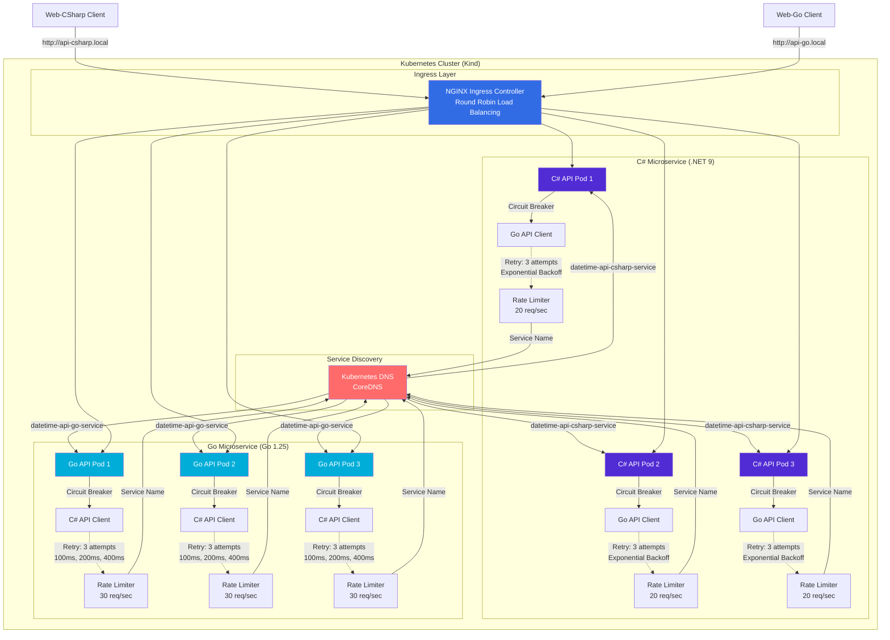
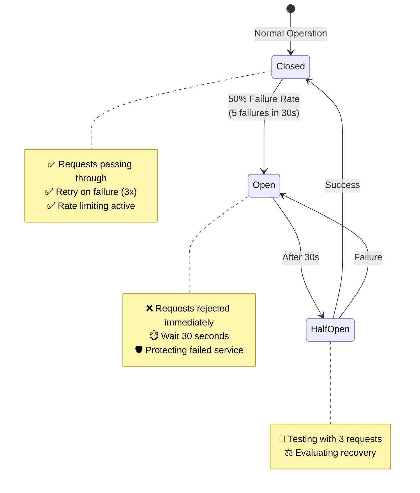
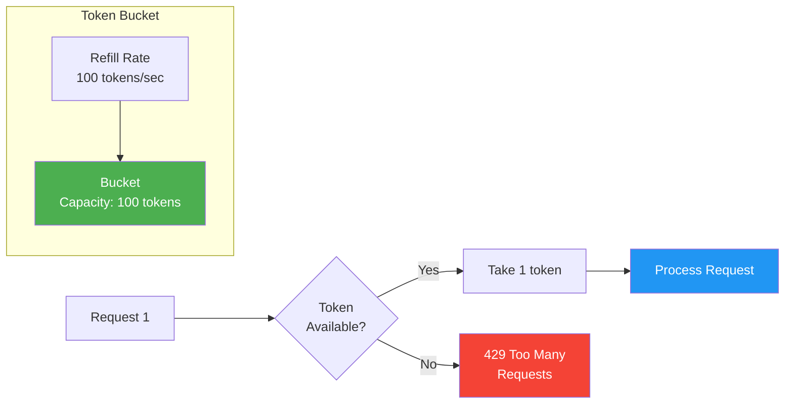
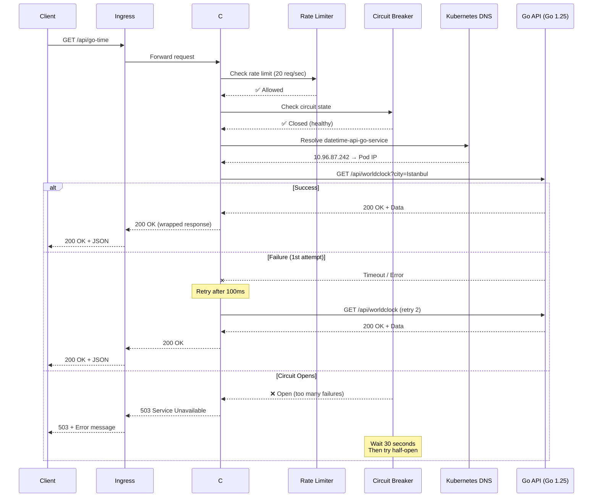
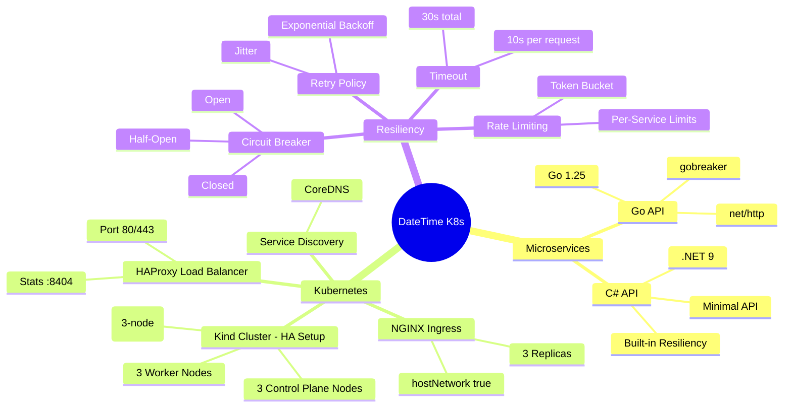

# Architecture Diagram

## Service-to-Service Communication Architecture



## Resiliency Features



## Rate Limiting: Token Bucket Algorithm



## Request Flow Example



## Technology Stack



---

## How to View

### GitHub
Upload `architecture-diagram.png` to repository settings → Social preview

### README
Add this to README.md:
```markdown
## Architecture

```

### Mermaid Live Editor
1. Copy any diagram above
2. Go to https://mermaid.live
3. Paste and edit
4. Export as PNG/SVG
