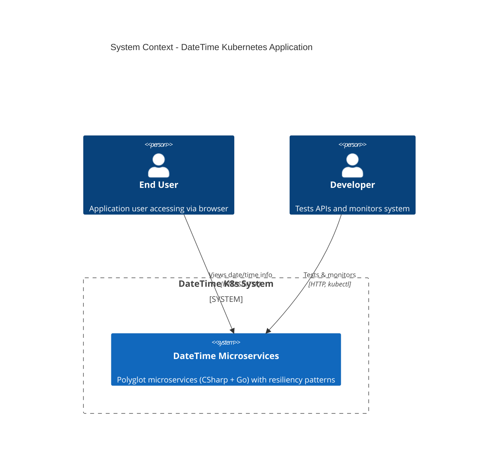
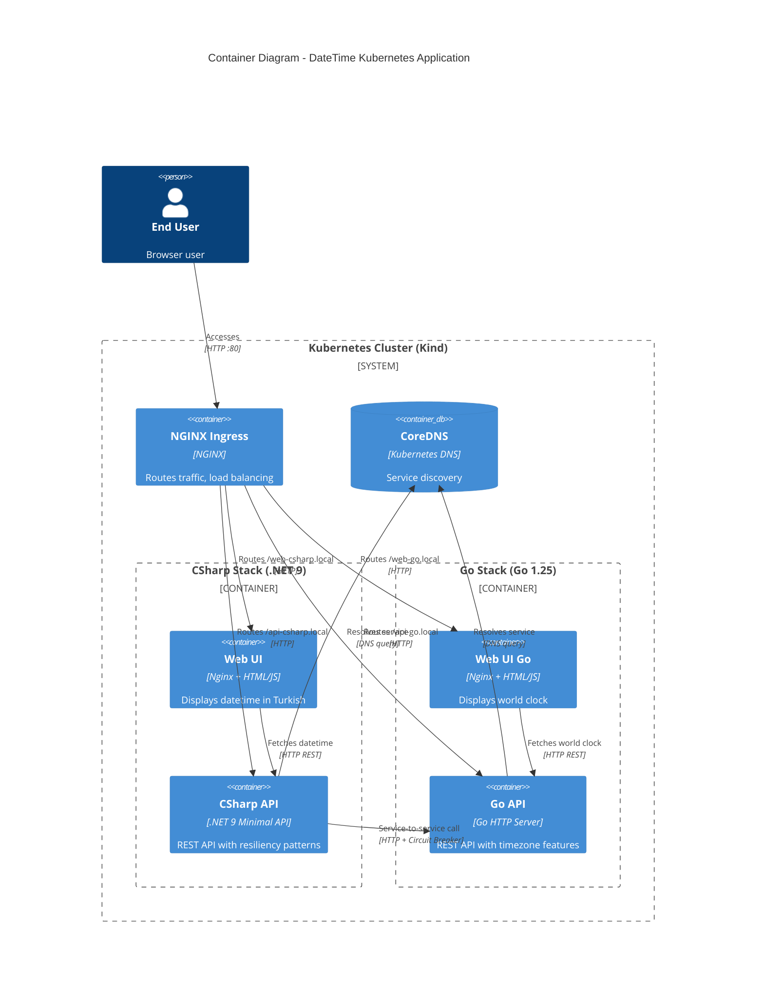
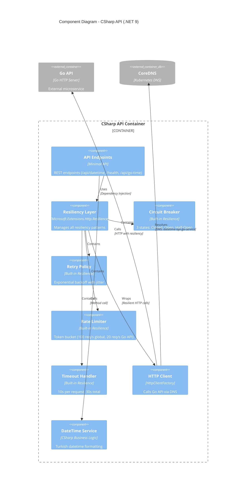
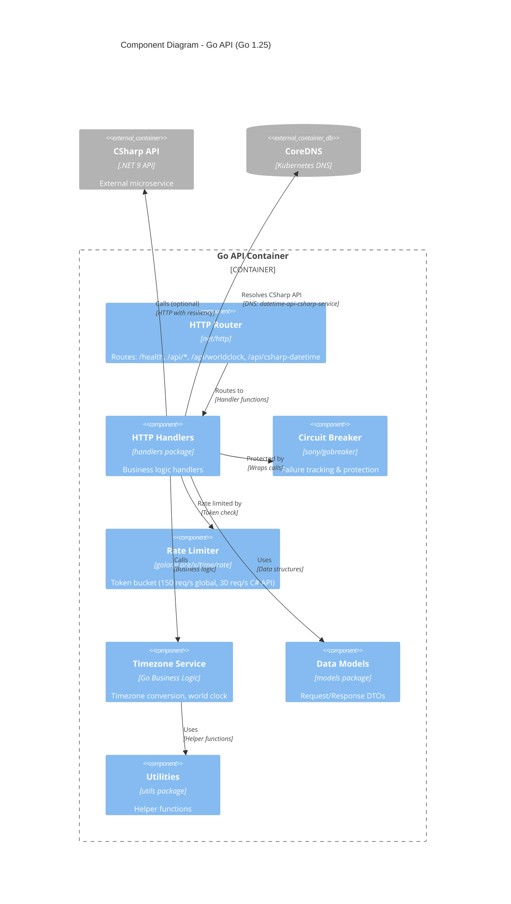

# C4 Model Architecture Diagrams

This file contains C4 model diagrams for the DateTime Kubernetes project.

## Level 1: System Context Diagram

Shows the big picture - who uses the system and what external systems it interacts with.

## Level 2: Container Diagram

Shows the high-level technology choices and how containers communicate.

## Level 3: Component Diagram - CSharp API

Shows the internal components of the CSharp API and resiliency patterns.

## Level 3: Component Diagram - Go API

Shows the internal components of the Go API and resiliency patterns.

## Deployment Diagram (Bonus)

Shows how containers are deployed to Kubernetes infrastructure in HA setup.

```mermaid
C4Deployment
    title Deployment Diagram - HA Kubernetes Kind Cluster (3+3 Setup)

    Deployment_Node(local_machine, "Local Machine", "macOS / Linux") {

        Deployment_Node(haproxy_host, "HAProxy Load Balancer", "Docker Container") {
            Container(haproxy, "HAProxy 2.9", "Load Balancer", "External LB - Port 80/443/8404")
        }

        Deployment_Node(docker, "Docker Desktop", "Docker Engine") {
            Deployment_Node(kind_cluster, "Kind Cluster", "Kubernetes v1.34 - HA Setup") {

                Deployment_Node(control_plane1, "Control Plane 1", "kindest/node:v1.34.0") {
                    Container(k8s_api1, "K8s API Server", "kube-apiserver", "Cluster management")
                    Container(etcd1, "etcd", "etcd v3.5", "Distributed KV Store 1/3")
                }

                Deployment_Node(control_plane2, "Control Plane 2", "kindest/node:v1.34.0") {
                    Container(k8s_api2, "K8s API Server", "kube-apiserver", "Cluster management")
                    Container(etcd2, "etcd", "etcd v3.5", "Distributed KV Store 2/3")
                }

                Deployment_Node(control_plane3, "Control Plane 3", "kindest/node:v1.34.0") {
                    Container(k8s_api3, "K8s API Server", "kube-apiserver", "Cluster management")
                    Container(etcd3, "etcd", "etcd v3.5", "Distributed KV Store 3/3")
                    Container(coredns, "CoreDNS", "DNS Server", "Service discovery")
                }

                Deployment_Node(worker1, "Worker Node 1", "kindest/node:v1.34.0") {
                    Container(ingress_ctrl1, "NGINX Ingress", "NGINX", "Replica 1/3 - hostNetwork:true")
                    Container(csharp_api_pod1, "CSharp API Pod", ".NET 9", "Replica 1/2")
                    Container(go_api_pod1, "Go API Pod", "Go 1.25", "Replica 1/3")
                    Container(csharp_web_pod1, "Web Pod", "Nginx", "Replica 1/2")
                }

                Deployment_Node(worker2, "Worker Node 2", "kindest/node:v1.34.0") {
                    Container(ingress_ctrl2, "NGINX Ingress", "NGINX", "Replica 2/3 - hostNetwork:true")
                    Container(csharp_api_pod2, "CSharp API Pod", ".NET 9", "Replica 2/2")
                    Container(go_api_pod2, "Go API Pod", "Go 1.25", "Replica 2/3")
                    Container(go_web_pod1, "Web-Go Pod", "Nginx", "Replica 1/2")
                }

                Deployment_Node(worker3, "Worker Node 3", "kindest/node:v1.34.0") {
                    Container(ingress_ctrl3, "NGINX Ingress", "NGINX", "Replica 3/3 - hostNetwork:true")
                    Container(go_api_pod3, "Go API Pod", "Go 1.25", "Replica 3/3")
                    Container(csharp_web_pod2, "Web Pod", "Nginx", "Replica 2/2")
                    Container(go_web_pod2, "Web-Go Pod", "Nginx", "Replica 2/2")
                }
            }
        }
    }

    Rel(haproxy, ingress_ctrl1, "Round-robin LB", "HTTP/HTTPS + Health Check")
    Rel(haproxy, ingress_ctrl2, "Round-robin LB", "HTTP/HTTPS + Health Check")
    Rel(haproxy, ingress_ctrl3, "Round-robin LB", "HTTP/HTTPS + Health Check")

    Rel(ingress_ctrl1, csharp_api_pod1, "Routes traffic", "Host: api-csharp.local")
    Rel(ingress_ctrl2, csharp_api_pod2, "Routes traffic", "Host: api-csharp.local")
    Rel(ingress_ctrl1, go_api_pod1, "Routes traffic", "Host: api-go.local")

    Rel(etcd1, etcd2, "Raft consensus", "etcd cluster")
    Rel(etcd2, etcd3, "Raft consensus", "etcd cluster")
    Rel(etcd3, etcd1, "Raft consensus", "etcd cluster")

    Rel(csharp_api_pod1, coredns, "Service discovery", "DNS")
    Rel(csharp_api_pod1, go_api_pod2, "Service call", "HTTP + Circuit Breaker")

    UpdateLayoutConfig($c4ShapeInRow="3", $c4BoundaryInRow="1")
```

---

## C4 Model Benefits for This Project

### 1. **Standardization**
- Industry-standard notation
- Familiar to architects and developers
- Easy to understand for stakeholders

### 2. **Multiple Abstraction Levels**
- **Level 1 (Context)**: Non-technical stakeholders
- **Level 2 (Container)**: DevOps, architects
- **Level 3 (Component)**: Developers
- **Deployment**: Infrastructure teams

### 3. **Clear Communication**
- Shows **WHO** uses the system (users, developers)
- Shows **WHAT** technology is used (containers)
- Shows **HOW** components interact (relationships)
- Shows **WHERE** it runs (deployment)

### 4. **Documentation Value**
- Self-documenting architecture
- Version controlled with code
- Easy to update as system evolves
- Great for onboarding new team members

---

**Generated with Mermaid C4 diagrams**
**Version:** 1.0
**Last Updated:** 2025-10-07
